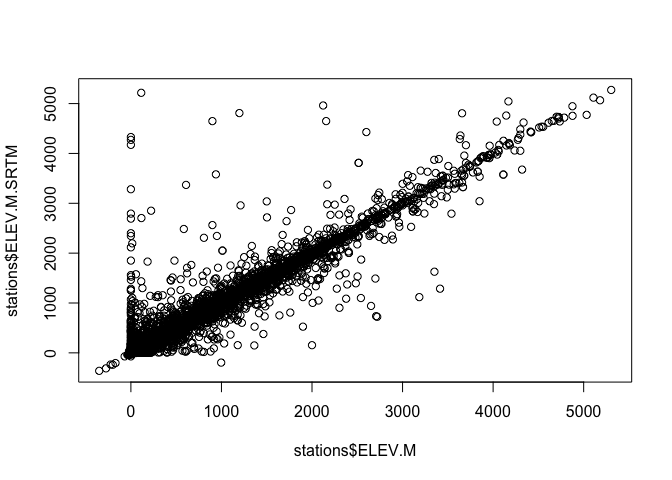

Fetch, clean and correct altitude in GSOD isd\_history.csv Data
================
Adam H. Sparks - Center for Crop Health, University of Southern Queensland
05-30-2016

Introduction
============

This script will fetch station data from the ftp server and clean up for inclusion in package in /data/stations.rda for the GSODR package.

The following changes are made:

-   Stations where latitude or longitude are NA or both 0 were removed

-   Stations where latitude is &lt; -90˚ or &gt; 90˚ were removed

-   Stations where longitude is &lt; -180˚ or &gt; 180˚ were removed

-   A new field, STNID, a concatenation of the USAF and WBAN fields, was added

-   Stations were checked against Natural Earth 1:10 ADM0 Cultural data, stations not mapping in the isd-history reported country were dropped

-   90m hole-filled SRTM digital elevation (Jarvis *et al.* 2008) was used to identify and correct/remove elevation errors in dat for station locations between -60˚ and 60˚. *Only for agroclimatology option data*

R Data Processing
=================

Load libraries and set up workspace
-----------------------------------

``` r
dem_tiles <- list.files(path.expand("~/Data/CGIAR-CSI SRTM"), 
                        pattern = glob2rx("*.tif"), full.names = TRUE)
crs <- "+proj=longlat +datum=WGS84 +no_defs +ellps=WGS84 +towgs84=0,0,0"
cor_stations <- list()
tf <- tempfile()
```

Download from Natural Earth and NCDC
------------------------------------

``` r
# import Natural Earth cultural 1:10m data (last download 31/05/2016)
curl::curl_download("http://www.naturalearthdata.com/http//www.naturalearthdata.com/download/10m/cultural/ne_10m_admin_0_countries.zip",
                    destfile = tf)
NE <- unzip(tf, exdir = "data-raw")
NE <- raster::shapefile("data-raw/ne_10m_admin_0_countries.shp")
unlink(tf)

# download data
stations <- readr::read_csv(
  "ftp://ftp.ncdc.noaa.gov/pub/data/noaa/isd-history.csv",
  col_types = "ccccccddddd",
  col_names = c("USAF", "WBAN", "STN.NAME", "CTRY", "STATE", "CALL",
                "LAT", "LON", "ELEV.M", "BEGIN", "END"), skip = 1)

stations[stations == -999.9] <- NA
stations[stations == -999] <- NA

countries <- readr::read_table(
  "ftp://ftp.ncdc.noaa.gov/pub/data/noaa/country-list.txt")[-1, c(1, 3)]

# join with countrycode data (do we need this?)
countries <- dplyr::left_join(countries, countrycode::countrycode_data,
                              by = c(FIPS = "fips104"))
```

Reformat and clean station data file from NCDC
----------------------------------------------

``` r
# clean data
stations <- stations[!is.na(stations$LAT) & !is.na(stations$LON), ]
stations <- stations[stations$LAT != 0 & stations$LON != 0, ]
stations <- stations[stations$LAT > -90 & stations$LAT < 90, ]
stations <- stations[stations$LON > -180 & stations$LON < 180, ]
stations$STNID <- paste(stations$USAF, stations$WBAN, sep = "-")

stations <- dplyr::left_join(stations, countries, by = c("CTRY" = "FIPS"))
```

Check data for inconsistencies
------------------------------

GSOD data have some inconsistencies in them, some of this has been removed above with filtering. Further filtering is used remove stations reporting locations in countries that do not match the physical coordinates reported. Using [Natural Earth Data 1:10 Cultural Data](http://www.naturalearthdata.com/downloads/10m-cultural-vectors/), the stations reported countries are checked against the country in which the coordinates map.

Also, reported elevation may differ from actual. Hijmans *et al.* (2005) created their own digital elevation model using Jarvis *et al.* (2004) and [GTOPO30 data](https://lta.cr.usgs.gov/GTOPO30) for areas where there was no SRTM data available (&gt;60˚). Here only the hole-filled SRTM data, V4 (Jarvis *et al.* 2008) was used for correction of agroclimatology data (-60˚ to 60˚). Any incorrect station elevations beyond these values were ignored in this data set. Stations with incorrect elevation were identified using `raster::extract(x, y, method = "bilinear")` in order that values of the four nearest cells are also used to determine elevation errors. See Hijmans *et al.* (2005) for more detailed information on this.

The hole-filled SRTM data is large enough that it won't all fit in-memory on most desktop computers. Using tiles allows this process to run on a modest machine with minimal effort but does take some time to loop through all of the tiles.

Data can be downloaded from the [CGIAR-CSI's](http://csi.cgiar.org/WhtIsCGIAR_CSI.asp) ftp server, [srtm.csi.cgiar.org](ftp://srtm.csi.cgiar.org), using an FTP client to facilitate this next step.

``` r
# quality check station locations for reported country and lat/lon position
# agreement

# create spatial object to check for location
stations <- as.data.frame(stations)
sp::coordinates(stations) <- ~LON + LAT
sp::proj4string(stations) <- sp::CRS(crs)

# check for location in country
point_check <- sp::over(stations, NE)
stations <- as.data.frame(stations)

stations_discard <- stations[stations$FIPS %in% point_check$FIPS_10_ == FALSE, ]
str(stations_discard)
```

    ## 'data.frame':    0 obs. of  27 variables:
    ##  $ USAF        : Factor w/ 24217 levels "008268","010010",..: 
    ##  $ WBAN        : Factor w/ 3051 levels "00001","00002",..: 
    ##  $ STN.NAME    : Factor w/ 25812 levels "","...","/OPEN WATER/",..: 
    ##  $ CTRY        : Factor w/ 249 levels "","AA","AC","AE",..: 
    ##  $ STATE       : Factor w/ 74 levels "","AK","AL","AR",..: 
    ##  $ CALL        : Factor w/ 7944 levels "","050E","07MT",..: 
    ##  $ LAT         : num 
    ##  $ LON         : num 
    ##  $ ELEV.M      : num 
    ##  $ BEGIN       : num 
    ##  $ END         : num 
    ##  $ STNID       : Factor w/ 27703 levels "008268-99999",..: 
    ##  $ COUNTRY.NAME: Factor w/ 246 levels "AFGHANISTAN",..: 
    ##  $ country.name: Factor w/ 220 levels "Afghanistan",..: 
    ##  $ cowc        : Factor w/ 189 levels "AAB","AFG","ALB",..: 
    ##  $ cown        : int 
    ##  $ fao         : int 
    ##  $ imf         : int 
    ##  $ ioc         : Factor w/ 195 levels "AFG","AIA","ALB",..: 
    ##  $ iso2c       : Factor w/ 219 levels "AF","AG","AI",..: 
    ##  $ iso3c       : Factor w/ 219 levels "ABW","AFG","AGO",..: 
    ##  $ iso3n       : int 
    ##  $ un          : int 
    ##  $ wb          : Factor w/ 220 levels "ABW","AFG","AGO",..: 
    ##  $ regex       : Factor w/ 220 levels "\\bcen.*\\baf|^c\\.?a\\.?r\\.?$",..: 
    ##  $ continent   : Factor w/ 5 levels "Africa","Americas",..: 
    ##  $ region      : Factor w/ 22 levels "Australia and New Zealand",..:

``` r
# 0 observations in stations_discard, the data look good, no need to remove any

# recreate spatial object for extracting elevation values using spatial points
sp::coordinates(stations) <- ~LON + LAT
sp::proj4string(stations) <- sp::CRS(crs)

for (i in dem_tiles) {
  
  # Load the DEM tile
  dem <- raster::raster(i)
  sub_stations <- raster::crop(stations, dem)
  
  # in some cases the DEM represents areas where there is no station
  # check for that here and if no stations, go on to next iteration
  if (is.null(sub_stations)) next
  
  # use a 200m buffer to extract elevation from the DEM
  gI <- raster::extract(dem, sub_stations, buffer = 200, fun = mean)
  sub_stations <- as.data.frame(sub_stations)
  sub_stations$ELEV.M.SRTM <- gI
  
  cor_stations[[i]] <- sub_stations
  rm(sub_stations)
}

stations <- as.data.frame(data.table::rbindlist(cor_stations))

# some stations occur in areas where DEM has no data
# use original station elevation in these cells
stations[, 28] <- ifelse(is.na(stations[, 28]), stations[, 9], stations[, 28])

summary(stations)
```

    ##       USAF            WBAN                      STN.NAME    
    ##  999999 : 1226   99999  :20980   APPROXIMATE LOCALE :   36  
    ##  949999 :  373   03849  :    5   MOORED BUOY        :   20  
    ##  722250 :    4   23176  :    5   ...                :   15  
    ##  746929 :    4   13786  :    4   BOGUS CHINESE      :   13  
    ##  992390 :    4   13829  :    4   PACIFIC BUOY       :    8  
    ##  997225 :    4   13877  :    4   APPROXIMATE LOCATIO:    7  
    ##  (Other):23263   (Other): 3876   (Other)            :24779  
    ##       CTRY           STATE            CALL            LAT        
    ##  US     : 6739          :18584          :14948   Min.   :-56.50  
    ##  CA     : 1609   CA     :  505   KLSF   :    6   1st Qu.: 21.79  
    ##  RS     : 1471   TX     :  487   KMLF   :    6   Median : 37.74  
    ##  AS     : 1411   FL     :  319   KBGR   :    5   Mean   : 29.35  
    ##  CH     : 1042   MI     :  231   KCXY   :    5   3rd Qu.: 47.17  
    ##  UK     :  675   NC     :  212   KDHN   :    5   Max.   : 60.00  
    ##  (Other):11931   (Other): 4540   (Other): 9903                   
    ##       LON               ELEV.M           BEGIN               END          
    ##  Min.   :-179.983   Min.   :-350.0   Min.   :19010101   Min.   :19301231  
    ##  1st Qu.: -83.737   1st Qu.:  25.0   1st Qu.:19570601   1st Qu.:20020208  
    ##  Median :   7.292   Median : 152.0   Median :19750618   Median :20150602  
    ##  Mean   :  -1.647   Mean   : 376.2   Mean   :19774305   Mean   :20040154  
    ##  3rd Qu.:  69.228   3rd Qu.: 455.0   3rd Qu.:20010816   3rd Qu.:20160528  
    ##  Max.   : 179.750   Max.   :5304.0   Max.   :20160526   Max.   :20160530  
    ##                     NA's   :194                                           
    ##           STNID              COUNTRY.NAME               country.name  
    ##  992390-99999:    4   UNITED STATES: 6739   United States     : 6739  
    ##  997225-99999:    4   CANADA       : 1609   Canada            : 1609  
    ##  030490-99999:    2   RUSSIA       : 1471   Russian Federation: 1471  
    ##  031160-99999:    2   AUSTRALIA    : 1411   Australia         : 1411  
    ##  031180-99999:    2   CHINA        : 1042   China             : 1042  
    ##  037000-99999:    2   (Other)      :12470   (Other)           :12391  
    ##  (Other)     :24862   NA's         :  136   NA's              :  215  
    ##       cowc            cown            fao             imf       
    ##  USA    : 6739   Min.   :  2.0   Min.   :  1.0   Min.   :111.0  
    ##  CAN    : 1609   1st Qu.:  2.0   1st Qu.: 73.0   1st Qu.:111.0  
    ##  RUS    : 1471   Median :255.0   Median :185.0   Median :193.0  
    ##  AUL    : 1411   Mean   :330.6   Mean   :156.2   Mean   :370.8  
    ##  CHN    : 1042   3rd Qu.:651.0   3rd Qu.:231.0   3rd Qu.:612.0  
    ##  (Other):12135   Max.   :990.0   Max.   :351.0   Max.   :968.0  
    ##  NA's   :  471   NA's   :471     NA's   :484     NA's   :356    
    ##       ioc            iso2c           iso3c           iso3n      
    ##  USA    : 6739   US     : 6739   USA    : 6739   Min.   :  4.0  
    ##  CAN    : 1609   CA     : 1609   CAN    : 1609   1st Qu.:158.0  
    ##  RUS    : 1471   RU     : 1471   RUS    : 1471   Median :598.0  
    ##  AUS    : 1411   AU     : 1411   AUS    : 1411   Mean   :506.6  
    ##  CHN    : 1042   CN     : 1042   CHN    : 1042   3rd Qu.:840.0  
    ##  (Other):12242   (Other):12385   (Other):12385   Max.   :894.0  
    ##  NA's   :  364   NA's   :  221   NA's   :  221   NA's   :221    
    ##        un              wb       
    ##  Min.   :  4.0   USA    : 6739  
    ##  1st Qu.:170.0   CAN    : 1609  
    ##  Median :598.0   RUS    : 1471  
    ##  Mean   :507.6   AUS    : 1411  
    ##  3rd Qu.:840.0   CHN    : 1042  
    ##  Max.   :894.0   (Other):12391  
    ##  NA's   :287     NA's   :  215  
    ##                                                         regex           
    ##  ^(?!.*islands).*united.?states|^u\\.?s\\.?a\\.?$|^u\\.?s\\.?$  : 6739  
    ##  canada                                                         : 1609  
    ##  \\brussia|soviet.?union|u\\.?s\\.?s\\.?r|socialist.?republics  : 1471  
    ##  australia                                                      : 1411  
    ##  ^(?!.*\\bmac)(?!.*\\bhong)(?!.*\\btai).*china|^p\\.?r\\.?c\\.?$: 1042  
    ##  (Other)                                                        :12391  
    ##  NA's                                                           :  215  
    ##     continent                           region      ELEV.M.SRTM     
    ##  Africa  : 1713   Northern America         :8349   Min.   :-360.94  
    ##  Americas:10286   Eastern Europe           :2368   1st Qu.:  24.52  
    ##  Asia    : 4817   Eastern Asia             :1772   Median : 153.26  
    ##  Europe  : 5915   Australia and New Zealand:1511   Mean   : 379.43  
    ##  Oceania : 1860   Western Europe           :1413   3rd Qu.: 456.35  
    ##  NA's    :  287   (Other)                  :9178   Max.   :5273.35  
    ##                   NA's                     : 287   NA's   :52

``` r
devtools::use_data(stations, overwrite = TRUE)
```

    ## Saving stations as stations.rda to /Users/U8004755/Development/GSODR/data

``` r
# clean up Natural Earth data files before we leave
file.remove(path = "data-raw", pattern = glob2rx("ne_10m_admin_0_countries.*"))
```

    ## Warning in file.remove(path = "data-raw", pattern =
    ## glob2rx("ne_10m_admin_0_countries.*")): cannot remove file 'data-raw',
    ## reason 'Directory not empty'

    ## Warning in file.remove(path = "data-raw", pattern =
    ## glob2rx("ne_10m_admin_0_countries.*")): cannot remove file
    ## '^ne_10m_admin_0_countries\.', reason 'No such file or directory'

    ## [1] FALSE FALSE

Figure
======

``` r
plot(stations$ELEV.M.SRTM ~ stations$ELEV.M)
```

 \# Notes

Users of these data should take into account the following (from the [NCDC website](http://www7.ncdc.noaa.gov/CDO/cdoselect.cmd?datasetabbv=GSOD&countryabbv=&georegionabbv=)):

> "The following data and products may have conditions placed on their international commercial use. They can be used within the U.S. or for non-commercial international activities without restriction. The non-U.S. data cannot be redistributed for commercial purposes. Re-distribution of these data by others must provide this same notification." [WMO Resolution 40. NOAA Policy](http://www.wmo.int/pages/about/Resolution40.html)

References
==========

Hijmans, RJ, SJ Cameron, JL Parra, PG Jones, A Jarvis, 2005, Very High Resolution Interpolated Climate Surfaces for Global Land Areas. *International Journal of Climatology*. 25: 1965-1978. [DOI:10.1002/joc.1276](http://dx.doi.org/10.1002/joc.1276)

Jarvis, A, HI Reuter, A Nelson, E Guevara, 2008, Hole-filled SRTM for the globe Version 4, available from the CGIAR-CSI SRTM 90m Database (<http://srtm.csi.cgiar.org>)

Jarvis, A, J Rubiano, A Nelson, A Farrow and M Mulligan, 2004, Practical use of SRTM Data in the Tropics: Comparisons with Digital Elevation Models Generated From Cartographic Data. Working Document no. 198. Cali, CO. International Centre for Tropical Agriculture (CIAT): 32.
