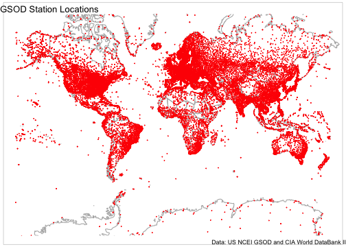

# Introduction

The GSOD or [Global Surface Summary of the Day (GSOD)](https://www.ncei.noaa.gov/access/metadata/landing-page/bin/iso?id=gov.noaa.ncdc:C00516) data provided by the US National Centers for Environmental Information (NCEI) are a valuable source of weather data with global coverage.
However, the data files are cumbersome and difficult to work with.
_GSODR_ aims to make it easy to find, transfer and format the data you need for use in analysis and provides four main functions for facilitating this:

- `get_GSOD()` - this function queries and transfers files from the NCEI's webpage, reformats them and returns a tidy data frame in R.

- `reformat_GSOD()` - this function takes individual station files from the local disk and re-formats them returning a tidy data frame in R.

- `nearest_stations()` - this function returns a vector of station IDs that fall within the given radius (kilometres) of a point given as latitude and longitude in order from nearest to farthest.

- `update_station_list()` - this function downloads the latest station list from the NCEI's server updates the package's internal database of stations and their metadata.

- `get_inventory()` - this function downloads the latest station inventory information from the NCEI's server and returns the header information about the latest version as a message in the console and a data frame of the stations' inventories for each year and month that data are reported.

When reformatting data either with `get_GSOD()` or `reformat_GSOD()`, all units are converted from United States Customary System (USCS) to International System of Units (SI), _e.g._, inches to millimetres and Fahrenheit to Celsius.
Data in the R session summarise each year by station, which also includes vapour pressure and relative humidity elements calculated from existing data in GSOD.

For more information see the description of the data provided by NCEI, <https://www7.ncdc.noaa.gov/CDO/GSOD_DESC.txt>.

# Using get_GSOD()

## Find Stations in or near Toowoomba, Queensland, Australia

_GSODR_ provides lists of weather station locations and elevation values.
It's easy to find all stations in Australia.


```r
library("GSODR")

load(system.file("extdata", "isd_history.rda", package = "GSODR"))

# create data.frame for Australia only
Oz <- subset(isd_history, COUNTRY_NAME == "AUSTRALIA")

Oz
```

```
##              STNID                         NAME    LAT   LON CTRY STATE    BEGIN      END
##    1: 695023-99999          HORN ISLAND   (HID) -10.58 142.3   AS       19420804 20030816
##    2: 749430-99999           AIDELAIDE RIVER SE -13.30 131.1   AS       19430228 19440821
##    3: 749432-99999    BATCHELOR FIELD AUSTRALIA -13.05 131.1   AS       19421231 19430610
##    4: 749438-99999         IRON RANGE AUSTRALIA -12.70 143.3   AS       19420917 19440930
##    5: 749439-99999     MAREEBA AS/HOEVETT FIELD -17.05 145.4   AS       19420630 19440630
##   ---                                                                                    
## 1044: 959890-99999      BICHENO (COUNCIL DEPOT) -41.87 148.3   AS       19650101 20210115
## 1045: 959950-99999 LORD HOWE ISLAND WINDY POINT -31.53 159.1   AS       20120920 20210116
## 1046: 959970-99999    HEARD ISLAND (ATLAS COVE) -53.02  73.4   AS       19980301 20121220
## 1047: 996600-99999          ENVIRONM BUOY 55011 -40.80 144.3   AS       19930221 19970403
## 1048: 999999-82101               NORTHWEST CAPE -22.33 114.0   AS       19680305 19680430
##       COUNTRY_NAME ISO2C ISO3C
##    1:    AUSTRALIA    AU   AUS
##    2:    AUSTRALIA    AU   AUS
##    3:    AUSTRALIA    AU   AUS
##    4:    AUSTRALIA    AU   AUS
##    5:    AUSTRALIA    AU   AUS
##   ---                         
## 1044:    AUSTRALIA    AU   AUS
## 1045:    AUSTRALIA    AU   AUS
## 1046:    AUSTRALIA    AU   AUS
## 1047:    AUSTRALIA    AU   AUS
## 1048:    AUSTRALIA    AU   AUS
```

```r
# Look for a specific town in Australia
subset(Oz, grepl("TOOWOOMBA", NAME))
```

```
##           STNID              NAME    LAT   LON CTRY STATE    BEGIN      END COUNTRY_NAME
## 1: 945510-99999         TOOWOOMBA -27.58 151.9   AS       19561231 20120503    AUSTRALIA
## 2: 955510-99999 TOOWOOMBA AIRPORT -27.55 151.9   AS       19980301 20210116    AUSTRALIA
##    ISO2C ISO3C
## 1:    AU   AUS
## 2:    AU   AUS
```

## Download a Single Station and Year Using get_GSOD()

Now that we've seen where the reporting stations are located, we can download weather data from the station Toowoomba, Queensland, Australia for 2010 by using the STNID in the `station` parameter of `get_GSOD()`.


```r
tbar <- get_GSOD(years = 2010, station = "955510-99999")
str(tbar)
```

```
## Classes 'data.table' and 'data.frame':	365 obs. of  47 variables:
##  $ STNID           : chr  "955510-99999" "955510-99999" "955510-99999" "955510-99999" ...
##  $ NAME            : chr  "TOOWOOMBA AIRPORT" "TOOWOOMBA AIRPORT" "TOOWOOMBA AIRPORT" "TOOWOOMBA AIRPORT" ...
##  $ CTRY            : chr  "AS" "AS" "AS" "AS" ...
##  $ COUNTRY_NAME    : chr  "AUSTRALIA" "AUSTRALIA" "AUSTRALIA" "AUSTRALIA" ...
##  $ ISO2C           : chr  "AU" "AU" "AU" "AU" ...
##  $ ISO3C           : chr  "AUS" "AUS" "AUS" "AUS" ...
##  $ STATE           : chr  "" "" "" "" ...
##  $ LATITUDE        : num  -27.6 -27.6 -27.6 -27.6 -27.6 ...
##  $ LONGITUDE       : num  152 152 152 152 152 ...
##  $ ELEVATION       : num  642 642 642 642 642 642 642 642 642 642 ...
##  $ BEGIN           : int  19980301 19980301 19980301 19980301 19980301 19980301 19980301 19980301 19980301 19980301 ...
##  $ END             : int  20210116 20210116 20210116 20210116 20210116 20210116 20210116 20210116 20210116 20210116 ...
##  $ YEARMODA        : Date, format: "2010-01-01" "2010-01-02" "2010-01-03" ...
##  $ YEAR            : int  2010 2010 2010 2010 2010 2010 2010 2010 2010 2010 ...
##  $ MONTH           : int  1 1 1 1 1 1 1 1 1 1 ...
##  $ DAY             : int  1 2 3 4 5 6 7 8 9 10 ...
##  $ YDAY            : int  1 2 3 4 5 6 7 8 9 10 ...
##  $ TEMP            : num  21.2 23.2 21.4 18.9 20.5 21.9 21.3 20.9 21.9 22.3 ...
##  $ TEMP_ATTRIBUTES : chr  " 8" " 8" " 8" " 8" ...
##  $ DEWP            : num  17.9 19.4 18.9 16.4 16.4 18.7 17.4 17.1 16.2 14.9 ...
##  $ DEWP_ATTRIBUTES : chr  " 8" " 8" " 8" " 8" ...
##  $ SLP             : num  1013 1010 1012 1016 1016 ...
##  $ SLP_ATTRIBUTES  : chr  " 8" " 8" " 8" " 8" ...
##  $ STP             : num  942 939 941 944 944 ...
##  $ STP_ATTRIBUTES  : chr  " 8" " 8" " 8" " 8" ...
##  $ VISIB           : num  NA NA 14.3 23.3 NA NA NA NA NA NA ...
##  $ VISIB_ATTRIBUTES: chr  " 0" " 0" " 6" " 4" ...
##  $ WDSP            : num  4.3 3.7 7.6 8.7 7.5 6.3 7.8 7.5 6.8 6.3 ...
##  $ WDSP_ATTRIBUTES : chr  " 8" " 8" " 8" " 8" ...
##  $ MXSPD           : num  6.7 5.1 10.3 10.3 10.8 7.7 8.7 8.7 8.2 7.2 ...
##  $ GUST            : num  NA NA NA NA NA NA NA NA NA NA ...
##  $ MAX             : num  25.8 26.5 28.7 24.1 24.6 26.8 26.1 26.5 27.4 28.7 ...
##  $ MAX_ATTRIBUTES  : chr  NA NA NA NA ...
##  $ MIN             : num  17.8 19.1 19.3 16.9 16.7 17.5 19.1 18.5 17.8 17.7 ...
##  $ MIN_ATTRIBUTES  : chr  NA NA "*" "*" ...
##  $ PRCP            : num  1.5 0.3 19.8 1 0.3 0 0.3 2.5 0 0 ...
##  $ PRCP_ATTRIBUTES : chr  "G" "G" "G" "G" ...
##  $ SNDP            : num  NA NA NA NA NA NA NA NA NA NA ...
##  $ I_FOG           : num  0 0 1 0 0 1 1 0 1 1 ...
##  $ I_RAIN_DRIZZLE  : num  0 0 1 0 0 0 0 0 0 0 ...
##  $ I_SNOW_ICE      : num  0 0 0 0 0 0 0 0 0 0 ...
##  $ I_HAIL          : num  0 0 0 0 0 0 0 0 0 0 ...
##  $ I_THUNDER       : num  0 0 0 0 0 0 0 0 0 0 ...
##  $ I_TORNADO_FUNNEL: num  0 0 0 0 0 0 0 0 0 0 ...
##  $ EA              : num  2 2.2 2.2 1.9 1.9 2.2 2 1.9 1.8 1.7 ...
##  $ ES              : num  2.5 2.8 2.5 2.2 2.4 2.6 2.5 2.5 2.6 2.7 ...
##  $ RH              : num  81.5 79.2 85.7 85.4 77.3 82.1 78.5 78.9 70.1 62.9 ...
##  - attr(*, ".internal.selfref")=<externalptr>
```

## Using nearest_stations() to Download Multiple Stations at Once

Using the `nearest_stations()` function, you can find stations closest to a given point specified by latitude and longitude in decimal degrees.
This can be used to generate a vector to pass along to `get_GSOD()` and download the stations of interest.


```r
tbar_stations <- nearest_stations(LAT = -27.5598,
                                  LON = 151.9507,
                                  distance = 50)

tbar <- get_GSOD(years = 2010, station = tbar_stations)
str(tbar)
```

```
## Classes 'data.table' and 'data.frame':	1095 obs. of  47 variables:
##  $ STNID           : chr  "945520-99999" "945520-99999" "945520-99999" "945520-99999" ...
##  $ NAME            : chr  "OAKEY" "OAKEY" "OAKEY" "OAKEY" ...
##  $ CTRY            : chr  "AS" "AS" "AS" "AS" ...
##  $ COUNTRY_NAME    : chr  "AUSTRALIA" "AUSTRALIA" "AUSTRALIA" "AUSTRALIA" ...
##  $ ISO2C           : chr  "AU" "AU" "AU" "AU" ...
##  $ ISO3C           : chr  "AUS" "AUS" "AUS" "AUS" ...
##  $ STATE           : chr  "" "" "" "" ...
##  $ LATITUDE        : num  -27.4 -27.4 -27.4 -27.4 -27.4 ...
##  $ LONGITUDE       : num  152 152 152 152 152 ...
##  $ ELEVATION       : num  407 407 407 407 407 ...
##  $ BEGIN           : int  19730430 19730430 19730430 19730430 19730430 19730430 19730430 19730430 19730430 19730430 ...
##  $ END             : int  20210116 20210116 20210116 20210116 20210116 20210116 20210116 20210116 20210116 20210116 ...
##  $ YEARMODA        : Date, format: "2010-01-01" "2010-01-02" "2010-01-03" ...
##  $ YEAR            : int  2010 2010 2010 2010 2010 2010 2010 2010 2010 2010 ...
##  $ MONTH           : int  1 1 1 1 1 1 1 1 1 1 ...
##  $ DAY             : int  1 2 3 4 5 6 7 8 9 10 ...
##  $ YDAY            : int  1 2 3 4 5 6 7 8 9 10 ...
##  $ TEMP            : num  23.4 26.2 24.5 21.6 22.6 24.7 24 23.3 24.4 25.1 ...
##  $ TEMP_ATTRIBUTES : chr  "16" "16" "16" "16" ...
##  $ DEWP            : num  18.4 19.4 19.4 16.8 16.9 18.7 17.1 17.1 15.7 13.6 ...
##  $ DEWP_ATTRIBUTES : chr  "16" "16" "16" "16" ...
##  $ SLP             : num  1012 1009 1011 1015 1015 ...
##  $ SLP_ATTRIBUTES  : chr  "16" "16" "16" "16" ...
##  $ STP             : num  967 964 966 969 969 ...
##  $ STP_ATTRIBUTES  : chr  "16" "16" "16" "16" ...
##  $ VISIB           : num  NA NA NA NA NA NA NA NA NA NA ...
##  $ VISIB_ATTRIBUTES: chr  " 0" " 0" " 0" " 0" ...
##  $ WDSP            : num  4.3 4.1 6.1 7.5 4.4 4.3 5.8 6.2 5.6 4.5 ...
##  $ WDSP_ATTRIBUTES : chr  "16" "16" "16" "16" ...
##  $ MXSPD           : num  7.2 6.2 8.7 9.8 7.7 6.2 8.2 9.3 7.7 7.2 ...
##  $ GUST            : num  NA NA NA NA NA NA NA NA NA NA ...
##  $ MAX             : num  28.5 31.2 33.6 27.1 27.8 30.4 30 30.5 31.9 33.2 ...
##  $ MAX_ATTRIBUTES  : chr  NA NA NA NA ...
##  $ MIN             : num  19.5 20.5 21.3 18.8 18.4 18.6 20.6 18.6 17.2 16.2 ...
##  $ MIN_ATTRIBUTES  : chr  NA NA "*" "*" ...
##  $ PRCP            : num  0.5 0 3.3 0 0 0 0 0.3 0 0 ...
##  $ PRCP_ATTRIBUTES : chr  "G" "G" "G" "G" ...
##  $ SNDP            : num  NA NA NA NA NA NA NA NA NA NA ...
##  $ I_FOG           : num  0 0 0 0 0 0 0 0 0 0 ...
##  $ I_RAIN_DRIZZLE  : num  0 0 0 0 0 0 0 0 0 0 ...
##  $ I_SNOW_ICE      : num  0 0 0 0 0 0 0 0 0 0 ...
##  $ I_HAIL          : num  0 0 0 0 0 0 0 0 0 0 ...
##  $ I_THUNDER       : num  0 0 0 0 0 0 0 0 0 0 ...
##  $ I_TORNADO_FUNNEL: num  0 0 0 0 0 0 0 0 0 0 ...
##  $ EA              : num  2.1 2.2 2.2 1.9 1.9 2.2 1.9 1.9 1.8 1.6 ...
##  $ ES              : num  2.9 3.4 3.1 2.6 2.7 3.1 3 2.9 3.1 3.2 ...
##  $ RH              : num  73.5 66.2 73.3 74.2 70.2 69.3 65.3 68.2 58.4 48.9 ...
##  - attr(*, ".internal.selfref")=<externalptr>
```

## Plot Maximum and Minimum Temperature Values

Using the first data downloaded for a single station, 955510-99999, plot the
temperature for 2010.


```r
library("ggplot2")
library("tidyr")

# Create a dataframe of just the date and temperature values that we want to
# plot
tbar_temps <- tbar[, c("YEARMODA", "TEMP", "MAX", "MIN")]

# Gather the data from wide to long
tbar_temps <-
  pivot_longer(tbar_temps, cols = TEMP:MIN, names_to = "Measurement")

ggplot(data = tbar_temps, aes(x = YEARMODA,
                              y = value,
                              colour = Measurement)) +
  geom_line() +
  scale_color_brewer(type = "qual", na.value = "black") +
  scale_y_continuous(name = "Temperature") +
  scale_x_date(name = "Date") +
  ggtitle(label = "Max, min and mean temperatures for Toowoomba, Qld, AU",
          subtitle = "Data: U.S. NCEI GSOD") +
  theme_classic()
```


# Using reformat_GSOD()

You may have already downloaded GSOD data or may just wish to use your browser to download the files from the server to you local disk and not use the capabilities of `get_GSOD()`.
In that case the `reformat_GSOD()` function is useful.

There are two ways, you can either provide `reformat_GSOD()` with a list of specified station files or you can supply it with a directory containing all of the "STATION.csv" station files or "YEAR.zip" annual files that you wish to reformat.

**Note** _Any_ .csv file provided to `reformat_GSOD()` will be imported, if it is not a GSOD data file, this will lead to an error.
Make sure the directory and file lists are clean.

## Reformat a List of Local Files

In this example two STATION.csv files are in subdirectories of user's home directory and are listed for reformatting as a string.


```r
y <- c("~/GSOD/gsod_1960/20049099999.csv",
       "~/GSOD/gsod_1961/20049099999.csv")
x <- reformat_GSOD(file_list = y)
```

## Reformat all Local Files Found in Directory

In this example all STATION.csv files in the sub-folder GSOD/gsod_1960 will be imported and reformatted.


```r
x <- reformat_GSOD(dsn = "~/GSOD/gsod_1960")
```

# Using update_station_list()

_GSODR_ uses internal databases of station data from the NCEI to provide location and other metadata, _e.g._ elevation, station names, WMO codes, etc. to make the process of querying for weather data faster.
This database is created and packaged with _GSODR_ for distribution and is updated with new releases.
Users have the option of updating these databases after installing _GSODR_.
While this option gives the users the ability to keep the database up-to-date and gives _GSODR's_ authors flexibility in maintaining it, this also means that reproducibility may be affected since the same version of _GSODR_ may have different databases on different machines.
If reproducibility is necessary, care should be taken to ensure that the version of the databases is the same across different machines.

The database file `isd_history.rda` can be located on your local system by using the following command, `paste0(.libPaths(), "/GSODR/extdata")[1]`, unless you have specified another location for library installations and installed _GSODR_ there, in which case it would still be in `GSODR/extdata`.

To update _GSODR's_ internal database of station locations simply use `update_station_list()`, which will update the internal station database according to the latest data available from the NCEI.


```r
update_station_list()
```

# Using get_inventory()

_GSODR_ provides a function, `get_inventory()` to retrieve an inventory of the number of weather observations by station-year-month for the beginning of record through to current.

Following is an example of how to retrieve the inventory and check a station in Toowoomba, Queensland, Australia, which was used in an earlier example.


```r
inventory <- get_inventory()

inventory
```

```
##   *** FEDERAL CLIMATE COMPLEX INTEGRATED SURFACE DATA INVENTORY ***  
##    This inventory provides the number of weather observations by  
##    STATION-YEAR-MONTH for beginning of record through June 2021   
##                STNID NAME LAT LON CTRY STATE BEGIN END COUNTRY_NAME ISO2C ISO3C YEAR  JAN
##      1: 007018-99999 <NA>  NA  NA <NA>  <NA>    NA  NA         <NA>  <NA>  <NA> 2011    0
##      2: 007018-99999 <NA>  NA  NA <NA>  <NA>    NA  NA         <NA>  <NA>  <NA> 2013    0
##      3: 007026-99999 <NA>  NA  NA <NA>  <NA>    NA  NA         <NA>  <NA>  <NA> 2012    0
##      4: 007026-99999 <NA>  NA  NA <NA>  <NA>    NA  NA         <NA>  <NA>  <NA> 2014    0
##      5: 007026-99999 <NA>  NA  NA <NA>  <NA>    NA  NA         <NA>  <NA>  <NA> 2016    0
##     ---                                                                                  
## 657962:   A51256-451 <NA>  NA  NA <NA>  <NA>    NA  NA         <NA>  <NA>  <NA> 2017 2192
## 657963:   A51256-451 <NA>  NA  NA <NA>  <NA>    NA  NA         <NA>  <NA>  <NA> 2018 2192
## 657964:   A51256-451 <NA>  NA  NA <NA>  <NA>    NA  NA         <NA>  <NA>  <NA> 2019 2188
## 657965:   A51256-451 <NA>  NA  NA <NA>  <NA>    NA  NA         <NA>  <NA>  <NA> 2020 2165
## 657966:   A51256-451 <NA>  NA  NA <NA>  <NA>    NA  NA         <NA>  <NA>  <NA> 2021 2085
##          FEB  MAR  APR  MAY  JUN  JUL  AUG  SEP  OCT  NOV  DEC
##      1:    0 2104 2797 2543 2614  382    0    0    0    0    0
##      2:    0    0    0    0    0  710    0    0    0    0    0
##      3:    0    0    0    0    0  367    0    0    0    0    7
##      4:    0    0    0    0    0  180    0    4    0  552    0
##      5:    0    0    0    0  794    0    0    0    0    0    0
##     ---                                                       
## 657962: 1883 2204 1910 2145 2113 2218 2204 2082 2192 2103 2174
## 657963: 1887 2194 2113 2151 2095 2202 2197 1816 2195 2063 2178
## 657964: 2000 2143 2105 2187 2124 2184 2138 2077 1872 1508 2159
## 657965: 1455 2144 2125 2199 2123 2112 2192 2083 2079 2074 2187
## 657966: 1992 2217 1975 2146 1578    0    0    0    0    0    0
```

```r
subset(inventory, STNID %in% "955510-99999")
```

```
##   *** FEDERAL CLIMATE COMPLEX INTEGRATED SURFACE DATA INVENTORY ***  
##    This inventory provides the number of weather observations by  
##    STATION-YEAR-MONTH for beginning of record through June 2021   
##            STNID              NAME    LAT   LON CTRY STATE    BEGIN      END COUNTRY_NAME
##  1: 955510-99999 TOOWOOMBA AIRPORT -27.55 151.9   AS       19980301 20210116    AUSTRALIA
##  2: 955510-99999 TOOWOOMBA AIRPORT -27.55 151.9   AS       19980301 20210116    AUSTRALIA
##  3: 955510-99999 TOOWOOMBA AIRPORT -27.55 151.9   AS       19980301 20210116    AUSTRALIA
##  4: 955510-99999 TOOWOOMBA AIRPORT -27.55 151.9   AS       19980301 20210116    AUSTRALIA
##  5: 955510-99999 TOOWOOMBA AIRPORT -27.55 151.9   AS       19980301 20210116    AUSTRALIA
##  6: 955510-99999 TOOWOOMBA AIRPORT -27.55 151.9   AS       19980301 20210116    AUSTRALIA
##  7: 955510-99999 TOOWOOMBA AIRPORT -27.55 151.9   AS       19980301 20210116    AUSTRALIA
##  8: 955510-99999 TOOWOOMBA AIRPORT -27.55 151.9   AS       19980301 20210116    AUSTRALIA
##  9: 955510-99999 TOOWOOMBA AIRPORT -27.55 151.9   AS       19980301 20210116    AUSTRALIA
## 10: 955510-99999 TOOWOOMBA AIRPORT -27.55 151.9   AS       19980301 20210116    AUSTRALIA
## 11: 955510-99999 TOOWOOMBA AIRPORT -27.55 151.9   AS       19980301 20210116    AUSTRALIA
## 12: 955510-99999 TOOWOOMBA AIRPORT -27.55 151.9   AS       19980301 20210116    AUSTRALIA
## 13: 955510-99999 TOOWOOMBA AIRPORT -27.55 151.9   AS       19980301 20210116    AUSTRALIA
## 14: 955510-99999 TOOWOOMBA AIRPORT -27.55 151.9   AS       19980301 20210116    AUSTRALIA
## 15: 955510-99999 TOOWOOMBA AIRPORT -27.55 151.9   AS       19980301 20210116    AUSTRALIA
## 16: 955510-99999 TOOWOOMBA AIRPORT -27.55 151.9   AS       19980301 20210116    AUSTRALIA
## 17: 955510-99999 TOOWOOMBA AIRPORT -27.55 151.9   AS       19980301 20210116    AUSTRALIA
## 18: 955510-99999 TOOWOOMBA AIRPORT -27.55 151.9   AS       19980301 20210116    AUSTRALIA
## 19: 955510-99999 TOOWOOMBA AIRPORT -27.55 151.9   AS       19980301 20210116    AUSTRALIA
## 20: 955510-99999 TOOWOOMBA AIRPORT -27.55 151.9   AS       19980301 20210116    AUSTRALIA
## 21: 955510-99999 TOOWOOMBA AIRPORT -27.55 151.9   AS       19980301 20210116    AUSTRALIA
## 22: 955510-99999 TOOWOOMBA AIRPORT -27.55 151.9   AS       19980301 20210116    AUSTRALIA
## 23: 955510-99999 TOOWOOMBA AIRPORT -27.55 151.9   AS       19980301 20210116    AUSTRALIA
## 24: 955510-99999 TOOWOOMBA AIRPORT -27.55 151.9   AS       19980301 20210116    AUSTRALIA
##            STNID              NAME    LAT   LON CTRY STATE    BEGIN      END COUNTRY_NAME
##     ISO2C ISO3C YEAR JAN FEB MAR APR MAY JUN JUL AUG SEP OCT NOV DEC
##  1:    AU   AUS 1998   0   0 222 223 221 211 226 217 222 234 215 230
##  2:    AU   AUS 1999 213 201 235 224 244 229 239 247 236 246 233 243
##  3:    AU   AUS 2000 241 227 247 238 246 237 245 240 236 248 239 248
##  4:    AU   AUS 2001 245 223 246 238 239 236 243 240 237 236 235 246
##  5:    AU   AUS 2002 245 219 246 236 243 229 243 246 227 238 233 246
##  6:    AU   AUS 2003 244 217 220 232 235 233 246 242 218 239 225 245
##  7:    AU   AUS 2004 240 227 241 229 233 224 235 244 235 244 235 245
##  8:    AU   AUS 2005 241 221 242 240 247 239 247 247 234 242 239 246
##  9:    AU   AUS 2006 245 223 246 232 241 238 247 247 239 247 240 247
## 10:    AU   AUS 2007 247 222 244 240 248 240 244 244 239 247 237 246
## 11:    AU   AUS 2008 247 228 248 239 248 239 248 247 239 247 238 248
## 12:    AU   AUS 2009 245 222 246 235 244 237 248 248 239 248 239 248
## 13:    AU   AUS 2010 248 223 248 240 244 240 242 247 240 248 240 247
## 14:    AU   AUS 2011 247 224 247 240 247 240 248 247 239 248 239 248
## 15:    AU   AUS 2012 248 232 248 240 248 240 248 247 240 248 240 245
## 16:    AU   AUS 2013 236 220 247 233 248 239 252 247 238 248 239 246
## 17:    AU   AUS 2014 243 224 247 240 246 239 246 247 240 247 240 248
## 18:    AU   AUS 2015 248 222 248 239 247 240 247 248 239 247 238 247
## 19:    AU   AUS 2016 246 228 245 240 246 240 248 248 238 248 239 248
## 20:    AU   AUS 2017 247 224 248 240 248 239 248 247 239 248 240 248
## 21:    AU   AUS 2018 248 224 248 239 248 240 247 248 239 246 240 248
## 22:    AU   AUS 2019 247 224 246 240 248 240 248 248 240 248 239 248
## 23:    AU   AUS 2020 246 232 248 238 248 348 493 492 480 496 475 496
## 24:    AU   AUS 2021 485 483 742 720 743 522   0   0   0   0   0   0
##     ISO2C ISO3C YEAR JAN FEB MAR APR MAY JUN JUL AUG SEP OCT NOV DEC
```

# Notes

## WMO Resolution 40. NOAA Policy

_Users of these data should take into account the following (from the
[NCEI website](https://www7.ncdc.noaa.gov/CDO/cdoselect.cmd?datasetabbv=GSOD&countryabbv=&georegionabbv=)): _

> The following data and products may have conditions placed on their international commercial use. They can be used within the U.S. or for non-commercial international activities without restriction. The non-U.S. data cannot be redistributed for commercial purposes. Re-distribution of these data by others must provide this same notification. A log of IP addresses accessing these data and products will be maintained and may be made available to data providers.
For details, please consult: [WMO Resolution 40. NOAA Policy](https://community.wmo.int/resolution-40)

# Appendices

## Appendix 1: GSODR Final Data Format, Contents and Units

_GSODR_ formatted data include the following fields and units:

- **STNID** - Station number (WMO/DATSAV3 number) for the location;

- **NAME** - Unique text identifier;

- **CTRY** - Country in which the station is located. This field is the original FIPS code that NCEI provides;

- **COUNTRY_NAME** - Country in which the station is located. This field is the country name in English language;

- **ISO2C** - Country in which the station is located. This field is the two letter ISO country code;

- **ISO3C** - Country in which the station is located. This field is the three letter ISO country code;

- **LAT** - Latitude. *Station dropped in cases where values are < -90 or > 90 degrees or Lat = 0 and Lon = 0*;

- **LON** - Longitude. *Station dropped in cases where values are < -180 or > 180 degrees or Lat = 0 and Lon = 0*;

- **ELEVATION** - Elevation in metres;

- **YEARMODA** - Date in YYYYMMDD format;

- **YEAR** - The year (YYYY);

- **MONTH** - The month (mm);

- **DAY** - The day (dd);

- **YDAY** - Sequential day of year (not in original GSOD);

- **TEMP** - Mean daily temperature converted to degrees C to tenths.
Missing = `NA`;

- **TEMP\_ATTRIBUTES** - Number of observations used in calculating mean daily temperature;

- **DEWP** - Mean daily dew point converted to degrees C to tenths.
Missing = `NA`;

- **DEWP\_ATTRIBUTES** - Number of observations used in calculating mean daily dew point;

- **SLP** - Mean sea level pressure in millibars to tenths.
Missing = `NA`;

- **SLP\_ATTRIBUTES** - Number of observations used in calculating mean sea level pressure;

- **STP** - Mean station pressure for the day in millibars to tenths.
Missing = `NA`;

- **STP\_ATTRIBUTES** - Number of observations used in calculating mean station pressure;

- **VISIB** - Mean visibility for the day converted to kilometres to tenths.
Missing = `NA`;

- **VISIB\_ATTRIBUTES** - Number of observations used in calculating mean daily visibility;

- **WDSP** - Mean daily wind speed value converted to metres/second to tenths.
Missing = `NA`;

- **WDSP\_ATTRIBUTES** - Number of observations used in calculating mean daily wind speed;

- **MXSPD** - Maximum sustained wind speed reported for the day converted to metres/second to tenths.
Missing = `NA`;

- **GUST** - Maximum wind gust reported for the day converted to metres/second to tenths.
Missing = `NA`;

- **MAX** - Maximum temperature reported during the day converted to Celsius to tenths--time of max temp report varies by country and region, so this will sometimes not be the max for the calendar day.
Missing = `NA`;

- **MAX\_ATTRIBUTES** - Blank indicates max temp was taken from the explicit max temp report and not from the 'hourly' data.
An "\*" indicates max temp was derived from the hourly data (_i.e._, highest hourly or synoptic-reported temperature);

- **MIN** - Minimum temperature reported during the day converted to Celsius to tenths--time of min temp report varies by country and region, so this will sometimes not be the max for the calendar day.
Missing = `NA`;

- **MIN\_ATTRIBUTES** - Blank indicates max temp was taken from the explicit min temp report and not from the 'hourly' data.
An "\*" indicates min temp was derived from the hourly data (_i.e._, highest hourly or synoptic-reported temperature);

- **PRCP** - Total precipitation (rain and/or melted snow) reported during the day converted to millimetres to hundredths; will usually not end with the midnight observation, _i.e._, may include latter part of previous day.
A value of ".00" indicates no measurable precipitation (includes a trace).
Missing = NA;
*Note: Many stations do not report '0' on days with no precipitation-- therefore, `NA` will often appear on these days.
For example, a station may only report a 6-hour amount for the period during which rain fell.*
See `FLAGS_PRCP` column for source of data;

- **PRCP\_ATTRIBUTES** -

    - A = 1 report of 6-hour precipitation amount;

    - B = Summation of 2 reports of 6-hour precipitation amount;

    - C = Summation of 3 reports of 6-hour precipitation amount;

    - D = Summation of 4 reports of 6-hour precipitation amount;

    - E = 1 report of 12-hour precipitation amount;

    - F = Summation of 2 reports of 12-hour precipitation amount;

    - G = 1 report of 24-hour precipitation amount;

    - H = Station reported '0' as the amount for the day (*e.g.* from 6-hour reports), but also reported at least one occurrence of precipitation in hourly observations--this could indicate a trace occurred, but should be considered as incomplete data for the day;

    - I = Station did not report any precipitation data for the day and did not report any occurrences of precipitation in its hourly observations--it's still possible that precipitation occurred but was not reported;

- **SNDP** - Snow depth in millimetres to tenths.
Missing = `NA`;

- **I\_FOG** - Indicator for fog, (1 = yes, 0 = no/not reported) for the occurrence during the day;

- **I\_RAIN\_DRIZZLE** - Indicator for rain or drizzle, (1 = yes, 0 = no/not reported) for the occurrence during the day;

- **I\_SNOW\_ICE** - Indicator for snow or ice pellets, (1 = yes, 0 = no/not reported) for the occurrence during the day;

- **I\_HAIL** - Indicator for hail, (1 = yes, 0 = no/not reported) for the occurrence during the day;

- **I\_THUNDER** - Indicator for thunder, (1 = yes, 0 = no/not reported) for the occurrence during the day;

- **I_TORNADO_FUNNEL** - Indicator for tornado or funnel cloud, (1 = yes, 0 = no/not reported) for the occurrence during the day;

- **EA** - Mean daily actual vapour pressure as calculated using improved August-Roche-Magnus approximation [@Alduchov1996]. Missing = `NA`;

- **ES** - Mean daily saturation vapour pressure as calculated using improved August-Roche-Magnus approximation [@Alduchov1996]. Missing = `NA`;

- **RH** - Mean daily relative humidity as calculated using improved August-Roche-Magnus approximation [@Alduchov1996].
Missing = `NA`.

## Appendix 2: Map of Current GSOD Station Locations



# References
