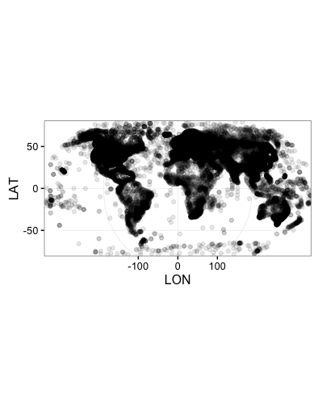

# Introduction

The GSOD or [Global Surface Summary of the Day (GSOD)](https://data.noaa.gov/dataset/global-surface-summary-of-the-day-gsod)
data provided by the US National Climatic Data Center (NCDC) are a valuable source of weather data with global coverage. However, the data files are cumbersome and difficult to work with. The GSODR package aims to make it easy to find, tranfer and format the data you need for use in analysis. The GSODR package provides four main functions for facilitating this:

* `get_GSOD()` - the main function that will query and transfer files from the FTP server, reformat them and return a data.frame in R or save a file to disk  
* `reformat_GSOD()` - the workhorse, this function takes individual station files on the local disk and reformats them returning a data.frame in R  
* `nearest_stations()` - this function returns a dataframe containing a list of stations and their metadata that fall within the given radius of a point specified by the user
* `get_station_list()` - this function retrieves the most up-to-date list of stations and corresponding metadata

When reformatting data either with `get_GSOD()` or `reformat_GSOD()`, all units are converted to International System of Units (SI), e.g., inches to millimetres and Fahrenheit to Celsius. File output can be saved as a Comma Separated Value (CSV) file or in a spatial GeoPackage (GPKG) file, implemented by most major GIS software, summarising each year by station, which also includes vapour pressure and relative humidity variables calculated from existing data in GSOD.

For more information see the description of the data provided by NCDC,
<http://www7.ncdc.noaa.gov/CDO/GSOD_DESC.txt>.

# Retrieving and Reformatting Data in R

## Plot Global Station Locations

The GSOD data are comprised of a global set of data from weather stations. To
visualise where these stations are located we can fetch the station metadata and
plot it in a map. The resulting map shows only stations with valid geo-locations
after filtering.

```r
library(GSODR)
GSOD_stations <- get_station_list()
```

Using [ggplot2](https://CRAN.R-project.org/package=ggplot2) and the 
[ggalt](https://CRAN.R-project.org/package=ggalt) package it is possible to plot
the station locations using alpha transparency to see the densest part of the
network and use the Robinson projection for the map.

```{r
library(ggplot2)
library(ggalt)

ggplot(GSOD_stations, aes(x = LON, y = LAT)) +
  geom_point(alpha = 0.1) +
  coord_proj("+proj=robin +lon_0=0 +x_0=0 +y_0=0 +ellps=WGS84 +datum=WGS84 +units=m +no_defs") +
  theme_bw()
```



## Find Stations in Australia

GSODR provides lists of weather station locations and elevation values. Using [dplyr](https://CRAN.R-project.org/package=dplyr), we can find all the stations in Australia.

```r
library(dplyr)
station_locations <- left_join(GSOD_stations, GSODR::country_list,
                               by = c("CTRY" = "FIPS"))

# create data.frame for Australia only
Oz <- filter(station_locations, COUNTRY_NAME == "AUSTRALIA")
head(Oz)

#>     USAF  WBAN                  STN_NAME CTRY STATE CALL     LAT     LON
#> 1 695023 99999       HORN ISLAND   (HID)   AS  <NA> KQXC -10.583 142.300
#> 2 749430 99999        AIDELAIDE RIVER SE   AS  <NA> <NA> -13.300 131.133
#> 3 749432 99999 BATCHELOR FIELD AUSTRALIA   AS  <NA> <NA> -13.049 131.066
#> 4 749438 99999      IRON RANGE AUSTRALIA   AS  <NA> <NA> -12.700 143.300
#> 5 749439 99999  MAREEBA AS/HOEVETT FIELD   AS  <NA> <NA> -17.050 145.400
#> 6 749440 99999                 REID EAST   AS  <NA> <NA> -19.767 146.850
#>   ELEV_M    BEGIN      END        STNID ELEV_M_SRTM_90m COUNTRY_NAME iso2c
#> 1     NA 19420804 20030816 695023-99999              24    AUSTRALIA    AU
#> 2    131 19430228 19440821 749430-99999              96    AUSTRALIA    AU
#> 3    107 19421231 19430610 749432-99999              83    AUSTRALIA    AU
#> 4     18 19420917 19440930 749438-99999              63    AUSTRALIA    AU
#> 5    443 19420630 19440630 749439-99999             449    AUSTRALIA    AU
#> 6    122 19421012 19430405 749440-99999              75    AUSTRALIA    AU
#>   iso3c
#> 1   AUS
#> 2   AUS
#> 3   AUS
#> 4   AUS
#> 5   AUS
#> 6   AUS

filter(Oz, STN_NAME == "TOOWOOMBA")
#>     USAF  WBAN  STN_NAME CTRY STATE CALL     LAT     LON ELEV_M    BEGIN
#> 1 945510 99999 TOOWOOMBA   AS  <NA> <NA> -27.583 151.933    676 19561231
#>        END        STNID ELEV_M_SRTM_90m COUNTRY_NAME iso2c iso3c
#> 1 20120503 945510-99999             670    AUSTRALIA    AU   AUS
```

## Using the get_GSOD() Function in GSODR to Download a Single Station and
Year

Now that we've seen where the reporting stations are located, we can download
weather data from the station Toowoomba, Queensland, Australia for 2010
by using the STNID in the `station` parameter of `get_GSOD()`.

```r
Tbar <- get_GSOD(years = 2010, station = "955510-99999")

#> Downloading the station file(s) now.

#> Finished downloading file. Parsing the station file(s) now.

head(Tbar)
#>    USAF  WBAN        STNID          STN_NAME CTRY STATE CALL    LAT     LON
#>1 955510 99999 955510-99999 TOOWOOMBA AIRPORT   AS  <NA> <NA> -27.55 151.917
#>2 955510 99999 955510-99999 TOOWOOMBA AIRPORT   AS  <NA> <NA> -27.55 151.917
#>3 955510 99999 955510-99999 TOOWOOMBA AIRPORT   AS  <NA> <NA> -27.55 151.917
#>4 955510 99999 955510-99999 TOOWOOMBA AIRPORT   AS  <NA> <NA> -27.55 151.917
#>5 955510 99999 955510-99999 TOOWOOMBA AIRPORT   AS  <NA> <NA> -27.55 151.917
#>6 955510 99999 955510-99999 TOOWOOMBA AIRPORT   AS  <NA> <NA> -27.55 151.917
#>  ELEV_M ELEV_M_SRTM_90m    BEGIN      END YEARMODA YEAR MONTH DAY YDAY TEMP
#>1    642             635 19980301 20161020 20100101 2010    01  01    1 21.2
#>2    642             635 19980301 20161020 20100102 2010    01  02    2 23.2
#>3    642             635 19980301 20161020 20100103 2010    01  03    3 21.4
#>4    642             635 19980301 20161020 20100104 2010    01  04    4 18.9
#>5    642             635 19980301 20161020 20100105 2010    01  05    5 20.5
#>6    642             635 19980301 20161020 20100106 2010    01  06    6 21.9
#>  TEMP_CNT DEWP DEWP_CNT    SLP SLP_CNT   STP STP_CNT VISIB VISIB_CNT WDSP
#>1        8 17.9        8 1013.4       8 942.0       8    NA         0  2.2
#>2        8 19.4        8 1010.5       8 939.3       8    NA         0  1.9
#>3        8 18.9        8 1012.3       8 940.9       8  14.3         6  3.9
#>4        8 16.4        8 1015.7       8 944.1       8  23.3         4  4.5
#>5        8 16.4        8 1015.5       8 944.0       8    NA         0  3.9
#>6        8 18.7        8 1013.7       8 942.3       8    NA         0  3.2
#>  WDSP_CNT MXSPD GUST   MAX MAX_FLAG   MIN MIN_FLAG PRCP PRCP_FLAG SNDP I_FOG
#>1        8   6.7   NA 25.78          17.78           1.5         G   NA     0
#>2        8   5.1   NA 26.50          19.11           0.3         G   NA     0
#>3        8  10.3   NA 28.72          19.28        * 19.8         G   NA     1
#>4        8  10.3   NA 24.11          16.89        *  1.0         G   NA     0
#>5        8  10.8   NA 24.61          16.72           0.3         G   NA     0
#>6        8   7.7   NA 26.78          17.50           0.0         G   NA     1
#>  I_RAIN_DRIZZLE I_SNOW_ICE I_HAIL I_THUNDER I_TORNADO_FUNNEL  EA  ES   RH
#>1              0          0      0         0                0 2.1 2.5 84.0
#>2              0          0      0         0                0 2.3 2.8 82.1
#>3              1          0      0         0                0 2.2 2.5 88.0
#>4              0          0      0         0                0 1.9 2.2 86.4
#>5              0          0      0         0                0 1.9 2.4 79.2
#>6              0          0      0         0                0 2.2 2.6 84.6
```

## Find Stations Within a Specified Distance of a Point

Using the `nearest_stations()` function, you can find stations closest to a
given point specified by latitude and longitude in decimal degrees. This can be
used to generate a vector to pass along to `get_GSOD()` and download the
stations of interest.

There are missing stations in this query. Not all that are listed and queried
actually have files on the server.

```r
tbar_stations <- nearest_stations(LAT = -27.5598, LON = 151.9507, distance = 50)
tbar_stations <- tbar_stations$STNID

get_GSOD(years = 2010, station = tbar_stations, dsn = "~/",
         filename = "Toowoomba_50km_2010")
```
If you wished to drop the stations, 949999-00170 and 949999-00183 from the
query, you could do this.

```r
remove <- c("949999-00170", "949999-00183")
tbar_stations <- tbar_stations[!tbar_stations %in% remove]

get_GSOD(years = 2010, station = tbar_stations, dsn = "~/",
         filename = "Toowoomba_50km")
```

## Plot Maximum and Miniumum Temperature Values

Using the first data downloaded for a single station, 955510-99999, plot the temperature for 2010 using `read_csv()` from Hadley's [readr](https://CRAN.R-project.org/package=readr) package.

```r
library(lubridate)
library(readr)
library(tidyr)

# Import the data for Toowoomba previously downloaded and cleaned
tbar <- read_csv("~/Toowoomba_Airport-2010.csv")

#> Parsed with column specification:
#> cols(
#>   .default = col_double(),
#>   USAF = col_integer(),
#>   WBAN = col_integer(),
#>   STNID = col_character(),
#>   STN_NAME = col_character(),
#>   CTRY = col_character(),
#>   STATE = col_character(),
#>   CALL = col_character(),
#>   YEARMODA = col_integer(),
#>   YEAR = col_integer(),
#>   MONTH = col_character(),
#>   DAY = col_character(),
#>   TEMP_CNT = col_integer(),
#>   DEWP_CNT = col_integer(),
#>   SLP_CNT = col_integer(),
#>   STP_CNT = col_integer(),
#>   VISIB_CNT = col_integer(),
#>   WDSP_CNT = col_integer(),
#>   MAX_FLAG = col_character(),
#>   MIN_FLAG = col_character(),
#>   PRCP_FLAG = col_character()
#>   # ... with 6 more columns
#> )
#> See spec(...) for full column specifications.

# Create a dataframe of just the date and temperature values that we want to
# plot
tbar_temps <- tbar[, c(14, 19, 33, 35)]

# Gather the data from wide to long
tbar_temps <- gather(tbar_temps, Measurement, gather_cols = TEMP:MIN)

ggplot(data = tbar_temps, aes(x = ymd(YEARMODA), y = value,
                              colour = Measurement)) +
  geom_line() +
  scale_color_brewer(type = "qual", na.value = "black") +
  scale_y_continuous(name = "Temperature") +
  scale_x_date(name = "Date") +
  theme_bw()
```


## Creating Spatial Files

Because the stations provide geospatial location information, it is possible to create a spatial file. [GeoPackage files](http://www.geopackage.org) are a open, standards-based, platform-independent, portable, self-describing compact
format for transferring geospatial information, which handle vector files much like shapefiles do, but eliminate many of the issues that shapefiles have with field names and the number of files. The `get_GSOD()` function can create a GeoPackage file, which can be used with a GIS for further analysis and mapping with other spatial objects.

After getting weather stations for Australia and creating a GeoPackage file, the rgdal package can import the data into R and the raster package can download an outline of Australia useful for plotting the station locations in this country.

```r
get_GSOD(years = 2015, country = "Australia", dsn = "~/", filename = "AUS",
         CSV = FALSE, GPKG = TRUE)
#> trying URL 'ftp://ftp.ncdc.noaa.gov/pub/data/gsod/2015/gsod_2015.tar'
#> Content type 'unknown' length 106352640 bytes (101.4 MB)
#> ==================================================
#> downloaded 101.4 MB


#> Finished downloading file.
              
#> Parsing the indivdual station files now.


#> Finished parsing files. Writing files to disk now.
```

Importing the GeoPackage file can be a bit tricky. The dsn will be the full path along with the file name. The layer to be specified is "GSOD", this is specified in the `get_GSOD()` function and will not change. The file name, specified in
the dsn will, but the layer name will not. 

```r
library(rgdal)
#> Loading required package: sp
#> rgdal: version: 1.1-10, (SVN revision 622)
#>  Geospatial Data Abstraction Library extensions to R successfully loaded
#>  Loaded GDAL runtime: GDAL 1.11.5, released 2016/07/01
#>  Path to GDAL shared files: /usr/local/Cellar/gdal/1.11.5_1/share/gdal
#>  Loaded PROJ.4 runtime: Rel. 4.9.3, 15 August 2016, [PJ_VERSION: 493]
#>  Path to PROJ.4 shared files: (autodetected)
#>  Linking to sp version: 1.2-3 

AUS_stations <- readOGR(dsn = path.expand("~/AUS-2015.gpkg"), layer = "GSOD")
#> OGR data source with driver: GPKG 
#> Source: "/Users/asparks/AUS-2015.gpkg", layer: "GSOD"
#> with 165168 features
#> It has 46 fields

class(AUS_stations)
#> [1] "SpatialPointsDataFrame"
#> attr(,"package")
#> [1] "sp"
```

Since GeoPackage files are formatted as SQLite databases you can use the existing R tools for SQLite files
[(J. Stachelek 2016)](https://jsta.github.io/2016/07/14/geopackage-r.html). One easy way is using dplyr, which we've already used to filter the stations.

This option is much faster to load since it does not load the geometry.

```r
AUS_sqlite <- tbl(src_sqlite(path.expand("~/AUS-2015.gpkg")), "GSOD")
class(AUS_sqlite)
#> [1] "tbl_sqlite" "tbl_sql"    "tbl_lazy"   "tbl"       

print(AUS_sqlite, n = 5)
#> Source:   query [?? x 48]
#> Database: sqlite 3.8.6 [/Users/asparks/AUS-2015.gpkg]
#> 
#>     fid       geom   USAF  WBAN        STNID          STN_NAME  CTRY STATE
#>   <int>     <list>  <chr> <chr>        <chr>             <chr> <chr> <chr>
#> 1     1 <raw [29]> 941030 99999 941030-99999 BROWSE ISLAND AWS    AS -9999
#> 2     2 <raw [29]> 941030 99999 941030-99999 BROWSE ISLAND AWS    AS -9999
#> 3     3 <raw [29]> 941030 99999 941030-99999 BROWSE ISLAND AWS    AS -9999
#> 4     4 <raw [29]> 941030 99999 941030-99999 BROWSE ISLAND AWS    AS -9999
#> 5     5 <raw [29]> 941030 99999 941030-99999 BROWSE ISLAND AWS    AS -9999
#> # ... with more rows, and 40 more variables: CALL <chr>, ELEV_M <dbl>,
#> #   ELEV_M_SRTM_90m <dbl>, BEGIN <dbl>, END <dbl>, YEARMODA <chr>,
#> #   YEAR <chr>, MONTH <chr>, DAY <chr>, YDAY <dbl>, TEMP <dbl>,
#> #   TEMP_CNT <int>, DEWP <dbl>, DEWP_CNT <int>, SLP <dbl>, SLP_CNT <int>,
#> #   STP <dbl>, STP_CNT <int>, VISIB <dbl>, VISIB_CNT <int>, WDSP <dbl>,
#> #   WDSP_CNT <int>, MXSPD <dbl>, GUST <dbl>, MAX <dbl>, MAX_FLAG <chr>,
#> #   MIN <dbl>, MIN_FLAG <chr>, PRCP <dbl>, PRCP_FLAG <chr>, SNDP <dbl>,
#> #   I_FOG <int>, I_RAIN_DRIZZLE <int>, I_SNOW_ICE <int>, I_HAIL <int>,
#> #   I_THUNDER <int>, I_TORNADO_FUNNEL <int>, EA <dbl>, ES <dbl>, RH <dbl>

```
# Reformating Local Data Files

You may have already downloaded GSOD data or may just wish to use an FTP client to download the files from the server to you local disk and not use the capabilities of `get_GSOD()`. In that case the `reformat_GSOD()` function is useful.

There are two ways, you can either provide `reformat_GSOD()` with a list of specified station files or you can supply it with a directory containing all of the "WBAN-WMO-YYYY.op.gz" station files that you wish to reformat.

## Reformat a List of Local Files

```r
y <- c("~/GSOD/gsod_1960/200490-99999-1960.op.gz",
       "~/GSOD/gsod_1961/200490-99999-1961.op.gz")
x <- reformat_GSOD(file_list = y)
```

## Reformat All Local Files Found in Directory

```r
x <- reformat_GSOD(dsn = "~/GSOD/gsod_1960")
```

# Additional Climate Data

Additional climate data, [GSODdata](https://github.com/adamhsparks/GSODRdata), formatted for use with GSOD data provided by GSODR are available as an R package instalable through GitHub due to the package size, 5.1Mb, being too large for CRAN.

```r
#install.packages("devtools")
devtools::install_github("adamhsparks/GSODdata")
library("GSODdata")
````

# Notes

## Elevation Values

90 metre (90m) hole-filled SRTM digital elevation (Jarvis *et al.* 2008) was used to identify and correct/remove elevation errors in data for station locations between -60˚ and 60˚ latitude. This applies to cases here where elevation was missing in the reported values as well. In case the station reported an elevation and the DEM does not, the station reported is taken. For stations beyond -60˚ and 60˚ latitude, the values are station reported values in every instance. See <https://github.com/ropensci/GSODR/blob/devel/data-raw/fetch_isd-history.md>
for more detail on the correction methods.

## WMO Resolution 40. NOAA Policy

*Users of these data should take into account the following (from the [NCDC website](http://www7.ncdc.noaa.gov/CDO/cdoselect.cmd?datasetabbv=GSOD&countryabbv=&georegionabbv=)):*

> "The following data and products may have conditions placed on their international commercial use. They can be used within the U.S. or for non-commercial international activities without restriction. The non-U.S. data cannot be redistributed for commercial purposes. Re-distribution of these data by others must provide this same notification." [WMO Resolution 40. NOAA Policy](https://public.wmo.int/en/our-mandate/what-we-do/data-exchange-and-technology-transfer)

# References
Stachelek, J. (2016) Using the Geopackage Format with R. 
URL: https://jsta.github.io/2016/07/14/geopackage-r.html
