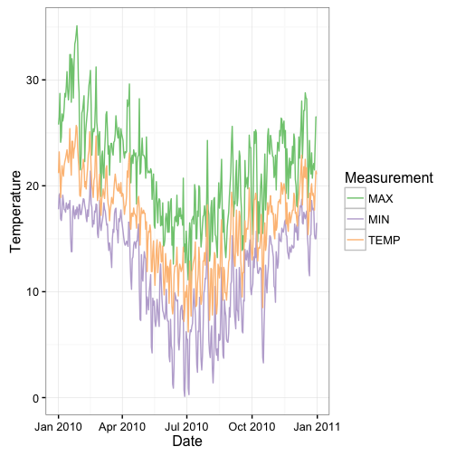

```{r check_packages, echo=FALSE, messages=FALSE, warning=FALSE}
required <- c("ggplot2", "tidyr", "lubridate")

if (!all(unlist(lapply(required, function(pkg) requireNamespace(pkg, quietly = TRUE)))))
  knitr::opts_chunk$set(eval = FALSE)
```

# Introduction

The GSOD or [Global Surface Summary of the Day (GSOD)](https://data.noaa.gov/dataset/global-surface-summary-of-the-day-gsod)
data provided by the US National Centers for Environmental Information (NCEI)
are a valuable source of weather data with global coverage. However, the data
files are cumbersome and difficult to work with. _GSODR_ aims to make it easy to
find, transfer and format the data you need for use in analysis and provides
four main functions for facilitating this:

- `get_GSOD()` - the main function that will query and transfer files from the
FTP server, reformat them and return a data.frame in R or save a file to disk

- `reformat_GSOD()` - the workhorse, this function takes individual station
files on the local disk and reformats them returning a data.frame in R

- `nearest_stations()` - this function returns a data frame containing a list of
stations and their metadata that fall within the given radius of a point
specified by the user  

- `update_station_list()` - this function downloads the latest station list from
the NCEI FTP server updates the package's internal database of stations and
their metadata.

When reformatting data either with `get_GSOD()` or `reformat_GSOD()`, all units
are converted to International System of Units (SI), e.g., inches to millimetres
and Fahrenheit to Celsius. File output can be saved as a Comma Separated Value
(CSV) file or in a spatial GeoPackage (GPKG) file, implemented by most major
GIS software, summarising each year by station, which also includes vapour
pressure and relative humidity elements calculated from existing data in GSOD.

For more information see the description of the data provided by NCEI,
<http://www7.ncdc.noaa.gov/CDO/GSOD_DESC.txt>.

# Retrieving and Reformatting Data in R

## Plot Global Station Locations

## Find Stations in Australia

_GSODR_ provides lists of weather station locations and elevation values. Using [_dplyr_](https://CRAN.R-project.org/package=dplyr), we can find all the
stations in Australia.

```{r, eval=FALSE}
library(dplyr)
data(country_list)
station_locations <- left_join(GSOD_stations, country_list,
                               by = c("CTRY" = "FIPS"))

# create data.frame for Australia only
Oz <- filter(station_locations, COUNTRY_NAME == "AUSTRALIA")
head(Oz)

#>     USAF  WBAN                  STN_NAME CTRY STATE CALL     LAT     LON
#> 1 695023 99999       HORN ISLAND   (HID)   AS  <NA> KQXC -10.583 142.300
#> 2 749430 99999        AIDELAIDE RIVER SE   AS  <NA> <NA> -13.300 131.133
#> 3 749432 99999 BATCHELOR FIELD AUSTRALIA   AS  <NA> <NA> -13.049 131.066
#> 4 749438 99999      IRON RANGE AUSTRALIA   AS  <NA> <NA> -12.700 143.300
#> 5 749439 99999  MAREEBA AS/HOEVETT FIELD   AS  <NA> <NA> -17.050 145.400
#> 6 749440 99999                 REID EAST   AS  <NA> <NA> -19.767 146.850
#>   ELEV_M    BEGIN      END        STNID ELEV_M_SRTM_90m COUNTRY_NAME iso2c
#> 1     NA 19420804 20030816 695023-99999              24    AUSTRALIA    AU
#> 2    131 19430228 19440821 749430-99999              96    AUSTRALIA    AU
#> 3    107 19421231 19430610 749432-99999              83    AUSTRALIA    AU
#> 4     18 19420917 19440930 749438-99999              63    AUSTRALIA    AU
#> 5    443 19420630 19440630 749439-99999             449    AUSTRALIA    AU
#> 6    122 19421012 19430405 749440-99999              75    AUSTRALIA    AU
#>   iso3c
#> 1   AUS
#> 2   AUS
#> 3   AUS
#> 4   AUS
#> 5   AUS
#> 6   AUS

filter(Oz, STN_NAME == "TOOWOOMBA")
#>     USAF  WBAN  STN_NAME CTRY STATE CALL     LAT     LON ELEV_M    BEGIN
#> 1 945510 99999 TOOWOOMBA   AS  <NA> <NA> -27.583 151.933    676 19561231
#>        END        STNID ELEV_M_SRTM_90m COUNTRY_NAME iso2c iso3c
#> 1 20120503 945510-99999             670    AUSTRALIA    AU   AUS
```

## Using the `get_GSOD()` Function in _GSODR_ to Download a Single Station and Year

Now that we've seen where the reporting stations are located, we can download
weather data from the station Toowoomba, Queensland, Australia for 2010 by using
the STNID in the `station` parameter of `get_GSOD()`.

```{r, eval=FALSE}
library(GSODR)
Tbar <- get_GSOD(years = 2010, station = "955510-99999")

#> Downloading the station file(s) now.

#> Finished downloading file. Parsing the station file(s) now.

head(Tbar)
```

## Find Stations Within a Specified Distance of a Point

Using the `nearest_stations()` function, you can find stations closest to a
given point specified by latitude and longitude in decimal degrees. This can be
used to generate a vector to pass along to `get_GSOD()` and download the
stations of interest.

There are missing stations in this query. Not all that are listed and queried
actually have files on the server.

```{r, eval=FALSE}
tbar_stations <-
  nearest_stations(LAT = -27.5598,
  LON = 151.9507,
  distance = 50)
  
  tbar <- get_GSOD(
  years = 2010,
  station = tbar_stations
  )
```
If you wished to drop the stations, 949999-00170 and 949999-00183 from the
query, you could do this.

```{r, eval=FALSE}
remove <- c("949999-00170", "949999-00183")

tbar_stations <- tbar_stations[!tbar_stations %in% remove]

tbar <- get_GSOD(years = 2010,
                 station = tbar_stations,
                 dsn = "~/")
```

## Plot Maximum and Miniumum Temperature Values

Using the first data downloaded for a single station, 955510-99999, plot the
temperature for 2010 using `read_csv()` from Hadley's
[`readr`](https://CRAN.R-project.org/package=readr) package.

```{r, eval=FALSE}
library(lubridate)
library(tidyr)

# Create a dataframe of just the date and temperature values that we want to
# plot
tbar_temps <- tbar[, c(13, 18, 32, 34)]

# Gather the data from wide to long
tbar_temps <- gather(tbar_temps, Measurement, gather_cols = TEMP:MIN)

ggplot(data = tbar_temps, aes(x = ymd(YEARMODA), y = value,
                              colour = Measurement)) +
  geom_line() +
  scale_color_brewer(type = "qual", na.value = "black") +
  scale_y_continuous(name = "Temperature") +
  scale_x_date(name = "Date") +
  theme_bw()
```


## Creating Spatial Files

Because the stations provide geospatial location information, it is possible to
create a spatial file. [GeoPackage files](http://www.geopackage.org) are a open,
standards-based, platform-independent, portable, self-describing compact
format for transferring geospatial information, which handle vector files much
like shapefiles do, but eliminate many of the issues that shapefiles have with
field names and the number of files. The `get_GSOD()` function can create a
GeoPackage file, which can be used with a GIS for further analysis and mapping
with other spatial objects.

After getting weather stations for Australia and creating a GeoPackage file,
_rgdal_ can import the data into R and _raster_ provides a function,
`getData()`, to download an outline of Australia useful for plotting the
station locations in this country.

```{r, eval=FALSE}
get_GSOD(years = 2015, country = "Australia", dsn = "~/", filename = "AUS",
         CSV = FALSE, GPKG = TRUE)
#> trying URL 'ftp://ftp.ncdc.noaa.gov/pub/data/gsod/2015/gsod_2015.tar'
#> Content type 'unknown' length 106352640 bytes (101.4 MB)
#> ==================================================
#> downloaded 101.4 MB


#> Finished downloading file.
              
#> Parsing the indivdual station files now.


#> Finished parsing files. Writing files to disk now.
```

Importing the GeoPackage file can be a bit tricky. The dsn will be the full path
along with the file name. The layer to be specified is "GSOD", this is specified
in the `get_GSOD()` function and will not change. The file name, specified in
the dsn will, but the layer name will not. 

```{r, eval=FALSE}
library(rgdal)
#> Loading required package: sp
#> rgdal: version: 1.1-10, (SVN revision 622)
#>  Geospatial Data Abstraction Library extensions to R successfully loaded
#>  Loaded GDAL runtime: GDAL 1.11.5, released 2016/07/01
#>  Path to GDAL shared files: /usr/local/Cellar/gdal/1.11.5_1/share/gdal
#>  Loaded PROJ.4 runtime: Rel. 4.9.3, 15 August 2016, [PJ_VERSION: 493]
#>  Path to PROJ.4 shared files: (autodetected)
#>  Linking to sp version: 1.2-3 

AUS_stations <- readOGR(dsn = path.expand("~/AUS.gpkg"), layer = "GSOD")
#> OGR data source with driver: GPKG 
#> Source: "/Users/asparks/AUS-2015.gpkg", layer: "GSOD"
#> with 165168 features
#> It has 46 fields

class(AUS_stations)
#> [1] "SpatialPointsDataFrame"
#> attr(,"package")
#> [1] "sp"
```

Since GeoPackage files are formatted as SQLite databases you can use the
existing R tools for SQLite files
[(J. Stachelek 2016)](https://jsta.github.io/2016/07/14/geopackage-r.html). One
easy way is using _dplyr_, which we've already used to filter the stations.

This option is much faster to load since it does not load the geometry.

```{r, eval=FALSE}
AUS_sqlite <- tbl(src_sqlite(path.expand("~/AUS.gpkg")), "GSOD")
class(AUS_sqlite)
#> [1] "tbl_sqlite" "tbl_sql"    "tbl_lazy"   "tbl"       

print(AUS_sqlite, n = 5)
#> Source:   query [?? x 48]
#> Database: sqlite 3.8.6 [/Users/asparks/AUS-2015.gpkg]
#> 
#>     fid       geom   USAF  WBAN        STNID          STN_NAME  CTRY STATE
#>   <int>     <list>  <chr> <chr>        <chr>             <chr> <chr> <chr>
#> 1     1 <raw [29]> 941030 99999 941030-99999 BROWSE ISLAND AWS    AS -9999
#> 2     2 <raw [29]> 941030 99999 941030-99999 BROWSE ISLAND AWS    AS -9999
#> 3     3 <raw [29]> 941030 99999 941030-99999 BROWSE ISLAND AWS    AS -9999
#> 4     4 <raw [29]> 941030 99999 941030-99999 BROWSE ISLAND AWS    AS -9999
#> 5     5 <raw [29]> 941030 99999 941030-99999 BROWSE ISLAND AWS    AS -9999
#> # ... with more rows, and 40 more variables: CALL <chr>, ELEV_M <dbl>,
#> #   ELEV_M_SRTM_90m <dbl>, BEGIN <dbl>, END <dbl>, YEARMODA <chr>,
#> #   YEAR <chr>, MONTH <chr>, DAY <chr>, YDAY <dbl>, TEMP <dbl>,
#> #   TEMP_CNT <int>, DEWP <dbl>, DEWP_CNT <int>, SLP <dbl>, SLP_CNT <int>,
#> #   STP <dbl>, STP_CNT <int>, VISIB <dbl>, VISIB_CNT <int>, WDSP <dbl>,
#> #   WDSP_CNT <int>, MXSPD <dbl>, GUST <dbl>, MAX <dbl>, MAX_FLAG <chr>,
#> #   MIN <dbl>, MIN_FLAG <chr>, PRCP <dbl>, PRCP_FLAG <chr>, SNDP <dbl>,
#> #   I_FOG <int>, I_RAIN_DRIZZLE <int>, I_SNOW_ICE <int>, I_HAIL <int>,
#> #   I_THUNDER <int>, I_TORNADO_FUNNEL <int>, EA <dbl>, ES <dbl>, RH <dbl>

```
# Reformating Local Data Files

You may have already downloaded GSOD data or may just wish to use an FTP client
to download the files from the server to you local disk and not use the
capabilities of `get_GSOD()`. In that case the `reformat_GSOD()` function is
useful.

There are two ways, you can either provide `reformat_GSOD()` with a list of
specified station files or you can supply it with a directory containing all of
the "WBAN-WMO-YYYY.op.gz" station files that you wish to reformat.

## Reformat a List of Local Files

```{r, eval=FALSE}
y <- c("~/GSOD/gsod_1960/200490-99999-1960.op.gz",
       "~/GSOD/gsod_1961/200490-99999-1961.op.gz")
x <- reformat_GSOD(file_list = y)
```

## Reformat All Local Files Found in Directory

```{r, eval=FALSE}
x <- reformat_GSOD(dsn = "~/GSOD/gsod_1960")
```

# Updating _GSODR's_ Internal Database of Station Locations and Metadata

_GSODR_ uses internal databases of station data from the NCEI to provide
location and other metadata, e.g. elevation, station names, WMO codes, etc. to
make the process of querying for weather data faster. This database is created
and packaged with _GSODR_ for distribution and is updated with new releases.
Users have the option of updating these databases after installing _GSODR_.
While this option gives the users the ability to keep the database up-to-date
and gives _GSODR's_ authors flexibility in maintaining it, this also means that
reproducibility may be affected since the same version of _GSODR_ may have
different databases on different machines. If reproducibility is necessary,
care should be taken to ensure that the version of the databases is the same
across different machines.

The database file `isd_history.rda` can be located on your local system by using
the following command,

```{r, eval=FALSE}
paste0(.libPaths(), "/GSODR/extdata")[1]
```

unless you have specified another location for library installations and
installed _GSODR_ there, in which case it would still be in `GSODR/extdata`.

# Additional Climate Data

Additional climate data,
[_GSODRdata_](https://github.com/adamhsparks/GSODRdata), formatted for use with
GSOD data provided by _GSODR_ are available as an R package installable through
GitHub due to the package size, 5.1Mb, being too large for CRAN.

```{r, eval=FALSE}
#install.packages("devtools")
devtools::install_github("adamhsparks/GSODRdata")
library("GSODRdata")
````

# Notes

## Elevation Values

90 metre (90m) hole-filled SRTM digital elevation (Jarvis *et al.* 2008) was
used to identify and correct/remove elevation errors in data for station
locations between -60˚ and 60˚ latitude. This applies to cases here where
elevation was missing in the reported values as well. In case the station
reported an elevation and the DEM does not, the station reported is taken. For
stations beyond -60˚ and 60˚ latitude, the values are station reported values
in every instance. See
<https://github.com/ropensci/GSODR/blob/master/data-raw/fetch_isd-history.md>
for more detail on the correction methods.

## WMO Resolution 40. NOAA Policy

*Users of these data should take into account the following (from the [NCEI website](http://www7.ncdc.noaa.gov/CDO/cdoselect.cmd?datasetabbv=GSOD&countryabbv=&georegionabbv=)):*

> "The following data and products may have conditions placed on their international commercial use. They can be used within the U.S. or for non-commercial international activities without restriction. The non-U.S. data cannot be redistributed for commercial purposes. Re-distribution of these data by others must provide this same notification." [WMO Resolution 40. NOAA Policy](https://public.wmo.int/en/our-mandate/what-we-do/data-exchange-and-technology-transfer)

# References
Stachelek, J. (2016) Using the Geopackage Format with R. 
URL: https://jsta.github.io/2016/07/14/geopackage-r.html


# Appendices

Appendix 1: GSODR Final Data Format, Contents and Units
------------------------------

_GSODR_ formatted data include the following fields and units:

- **STNID** - Station number (WMO/DATSAV3 number) for the location;

- **WBAN** - number where applicable--this is the historical "Weather Bureau
Air Force Navy" number - with WBAN being the acronym;

- **STN\_NAME** - Unique text identifier;

- **CTRY** - Country in which the station is located;

- **LAT** - Latitude. *Station dropped in cases where values are < -90 or > 90
degrees or Lat = 0 and Lon = 0*;

- **LON** - Longitude. *Station dropped in cases where values are < -180 or >
180 degrees or Lat = 0 and Lon = 0*;

- **ELEV\_M** - Elevation in metres;

- **ELEV\_M\_SRTM\_90m** - Elevation in metres corrected for possible errors,
derived from the CGIAR-CSI SRTM 90m database (Jarvis et al. 2008);

- **YEARMODA** - Date in YYYY-mm-dd format;

- **YEAR** - The year (YYYY);

- **MONTH** - The month (mm);

- **DAY** - The day (dd);

- **YDAY** - Sequential day of year (not in original GSOD);

- **TEMP** - Mean daily temperature converted to degrees C to tenths. Missing =
NA;

- **TEMP\_CNT** - Number of observations used in calculating mean daily
temperature;

- **DEWP** - Mean daily dew point converted to degrees C to tenths. Missing =
NA;

- **DEWP\_CNT** - Number of observations used in calculating mean daily dew
point;

- **SLP** - Mean sea level pressure in millibars to tenths. Missing = NA;

- **SLP\_CNT** - Number of observations used in calculating mean sea level
pressure;

- **STP** - Mean station pressure for the day in millibars to tenths. Missing
= NA;

- **STP\_CNT** - Number of observations used in calculating mean station
pressure;

- **VISIB** - Mean visibility for the day converted to kilometres to tenths
Missing = NA;

- **VISIB\_CNT** - Number of observations used in calculating mean daily
visibility;

- **WDSP** - Mean daily wind speed value converted to metres/second to tenths.
Missing = NA;

- **WDSP\_CNT** - Number of observations used in calculating mean daily wind
speed;

- **MXSPD** - Maximum sustained wind speed reported for the day converted to
metres/second to tenths. Missing = NA;

- **GUST** - Maximum wind gust reported for the day converted to metres/second
to tenths. Missing = NA;

- **MAX** - Maximum temperature reported during the day converted to Celsius to
tenths--time of max temp report varies by country and region, so this will
sometimes not be the max for the calendar day. Missing = NA;

- **MAX\_FLAG** - Blank indicates max temp was taken from the explicit max temp
report and not from the 'hourly' data. An "\*" indicates max temp was derived
from the hourly data (i.e., highest hourly or synoptic-reported temperature);

- **MIN** - Minimum temperature reported during the day converted to Celsius to
tenths--time of min temp report varies by country and region, so this will
sometimes not be the max for the calendar day. Missing = NA;

- **MIN\_FLAG** - Blank indicates max temp was taken from the explicit min temp report and not from the 'hourly' data. An "\*" indicates min temp was derived from the hourly data (i.e., highest hourly or synoptic-reported temperature);

- **PRCP** - Total precipitation (rain and/or melted snow) reported during the
day converted to millimetres to hundredths; will usually not end with the
midnight observation, i.e., may include latter part of previous day. A value of
".00" indicates no measurable precipitation (includes a trace). Missing = NA;
*Note: Many stations do not report '0' on days with no precipitation--
therefore, 'NA' will often appear on these days. For example, a station may
only report a 6-hour amount for the period during which rain fell.* See
`FLAGS_PRCP` column for source of data;

- **PRCP\_FLAG** -

    - A = 1 report of 6-hour precipitation amount;

    - B = Summation of 2 reports of 6-hour precipitation amount;

    - C = Summation of 3 reports of 6-hour precipitation amount;

    - D = Summation of 4 reports of 6-hour precipitation amount;

    - E = 1 report of 12-hour precipitation amount;

    - F = Summation of 2 reports of 12-hour precipitation amount;

    - G = 1 report of 24-hour precipitation amount;

    - H = Station reported '0' as the amount for the day (e.g., from 6-hour
    reports), but also reported at least one occurrence of precipitation in
    hourly observations--this could indicate a rrace occurred, but should be
    considered as incomplete data for the day;

    - I = Station did not report any precipitation data for the day and did not
    report any occurrences of precipitation in its hourly observations--it's
    still possible that precipitation occurred but was not reported;

- **SNDP** - Snow depth in millimetres to tenths. Missing = NA;

- **I\_FOG** - Indicator for fog, (1 = yes, 0 = no/not reported) for the
occurrence during the day;

- **I\_RAIN\_DRIZZLE** - Indicator for rain or drizzle, (1 = yes, 0 =
no/not reported) for the occurrence during the day;

- **I\_SNOW\_ICE** - Indicator for snow or ice pellets, (1 = yes, 0 =
no/not reported) for the occurrence during the day;

- **I\_HAIL** - Indicator for hail, (1 = yes, 0 = no/not reported) for the
occurrence during the day;

- **I\_THUNDER** - Indicator for thunder, (1 = yes, 0 = no/not reported) for the
occurrence during the day;

- **I_TORNADO_FUNNEL** - Indicator for tornado or funnel cloud, (1 = yes, 0 =
no/not reported) for the occurrence during the day;

- **ea** - Mean daily actual vapour pressure;

- **es** - Mean daily saturation vapour pressure;

- **RH** - Mean daily relative humidity.

## Appendix 2: Map of GSOD Station Locations

```{r, eval = TRUE, message = FALSE, echo = FALSE, warning=FALSE}
library(ggplot2)
library(GSODR)

load(system.file("extdata", "isd_history.rda", package = "GSODR"))

ggplot(isd_history, aes(x = LON, y = LAT)) +
  geom_point(alpha = 0.1) +
  theme_bw() +
  labs(title = "GSOD Station Locations",
       caption = "Data: US NCEI isd_history.csv")
```
