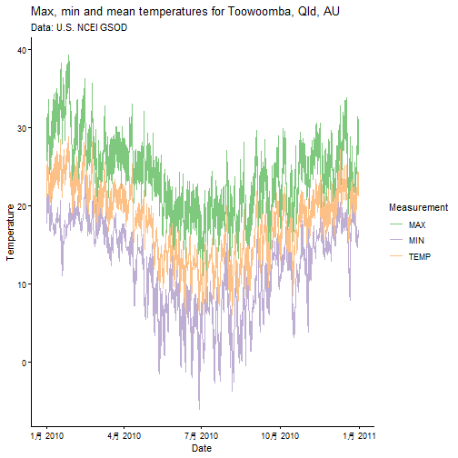
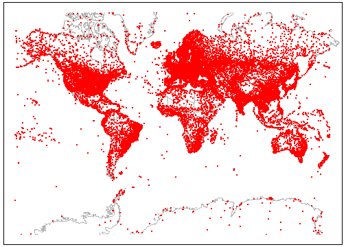

# Introduction

The GSOD or [Global Surface Summary of the Day (GSOD)](https://www.ncei.noaa.gov/access/metadata/landing-page/bin/iso?id=gov.noaa.ncdc:C00516) data provided by the US National Centers for Environmental Information (NCEI) are a valuable source of weather data with global coverage.
However, the data files are cumbersome and difficult to work with.
{GSODR} aims to make it easy to find, transfer and format the data you need for use in analysis and provides five main functions for facilitating this:

- `get_GSOD()` - this function queries and transfers files from the NCEI's web server, reformats them and returns a data frame.

- `reformat_GSOD()` - this function takes individual station files from the local disk and re-formats them returning a data frame.

- `nearest_stations()` - this function returns a `data.table` of stations with their metadata and the distance in which they fall from the given radius (kilometres) of a point given as latitude and longitude in order from nearest to farthest.

- `get_inventory()` - this function downloads the latest station inventory information from the NCEI's server and returns the header information about the latest version as a message in the console and a tidy data frame of the stations' inventory for each month that data are reported.

- `get_updates()` - this function downloads the changelog for the GSOD data from the NCEI's server and reorders it by the most recent changes first.

When reformatting data either with `get_GSOD()` or `reformat_GSOD()`, all units are converted from United States Customary System (USCS) to International System of Units (SI), _e.g._, inches to millimetres and Fahrenheit to Celsius.
Data in the R session summarise each year by station, which also includes vapour pressure and relative humidity elements calculated from existing data in GSOD.

For more information see the description of the data provided by NCEI, <https://www.ncei.noaa.gov/data/global-summary-of-the-day/doc/readme.txt>.

# Using get_GSOD()

## Find Stations in or near Toowoomba, Queensland, Australia

{GSODR} provides lists of weather station locations and elevation values.
It's easy to find all stations in Australia.


``` r
library("GSODR")
```

```
## Warning in runHook(".onAttach", ns, dirname(nspath), nsname): restarting
## interrupted promise evaluation
```

```
## Warning in runHook(".onAttach", ns, dirname(nspath), nsname): internal error 1
## in R_decompress1 with libdeflate
```

```
## Error: package or namespace load failed for 'GSODR' in runHook(".onAttach", ns, dirname(nspath), nsname):
##  lazy-load database '/Users/adamsparks/Library/R/arm64/4.5/library/GSODR/R/GSODR.rdb' is corrupt
```

``` r
load(system.file("extdata", "isd_history.rda", package = "GSODR"))

# create data.frame for Australia only
Oz <- subset(isd_history, COUNTRY_NAME == "AUSTRALIA")

Oz
```

```
## Key: <STNID>
##             STNID             NAME     LAT     LON ELEV(M)   CTRY  STATE
##            <char>           <char>   <num>   <num>   <num> <char> <char>
##   1: 110010-99999         WOLFSEGG  48.100  13.667   615.6     AU       
##   2: 110030-99999 RIED IM INNKREIS  48.217  13.483   443.0     AU       
##   3: 110050-99999 SCHAERDING/SUBEN  48.400  13.433   330.0     AU       
##   4: 110080-99999         ROHRBACH  48.567  14.000   602.0     AU       
##   5: 110090-99999    WELS/FLUGFELD  48.183  14.033   318.0     AU       
##  ---                                                                    
## 272: 958070-99999   KINGSTONE AERO -35.717 137.517     6.0     AU       
## 273: 958150-99999          MUNKORA -36.100 140.317    28.0     AU       
## 274: 958230-99999  PADTHAWAY SOUTH -36.650 140.517    35.0     AU       
## 275: 958310-99999 WALPEUP RESEARCH -35.117 142.000   105.0     AU       
## 276: 958450-99999    MT GELLIBRAND -38.233 143.783   262.0     AU       
##         BEGIN      END COUNTRY_NAME  ISO2C  ISO3C
##         <int>    <int>       <char> <char> <char>
##   1: 19730715 20250824    AUSTRALIA     AU    AUS
##   2: 19520103 19971225    AUSTRALIA     AU    AUS
##   3: 20010807 20010807    AUSTRALIA     AU    AUS
##   4: 19761101 20250824    AUSTRALIA     AU    AUS
##   5: 19340502 20050814    AUSTRALIA     AU    AUS
##  ---                                             
## 272: 19970101 20250824    AUSTRALIA     AU    AUS
## 273: 20030401 20250824    AUSTRALIA     AU    AUS
## 274: 20030401 20250824    AUSTRALIA     AU    AUS
## 275: 20010915 20250824    AUSTRALIA     AU    AUS
## 276: 20010918 20250824    AUSTRALIA     AU    AUS
```

``` r
# Look for a specific town in Australia
subset(Oz, grepl("TOOWOOMBA", NAME))
```

```
## Empty data.table (0 rows and 12 cols): STNID,NAME,LAT,LON,ELEV(M),CTRY...
```

## Download a Single Station and Year Using get_GSOD()

Now that we've seen where the reporting stations are located, we can download weather data from the station Toowoomba, Queensland, Australia for 2010 by using the STNID in the `station` parameter of `get_GSOD()`.


``` r
tbar <- get_GSOD(years = 2010, station = "955510-99999")
```

```
## Error in get_GSOD(years = 2010, station = "955510-99999"): could not find function "get_GSOD"
```

``` r
str(tbar)
```

```
## Classes 'data.table' and 'data.frame':	1095 obs. of  47 variables:
##  $ STNID           : chr  "945520-99999" "945520-99999" "945520-99999" "945520-99999" ...
##  $ NAME            : chr  "OAKEY" "OAKEY" "OAKEY" "OAKEY" ...
##  $ CTRY            : chr  "AS" "AS" "AS" "AS" ...
##  $ COUNTRY_NAME    : chr  "AUSTRALIA" "AUSTRALIA" "AUSTRALIA" "AUSTRALIA" ...
##  $ ISO2C           : chr  "AU" "AU" "AU" "AU" ...
##  $ ISO3C           : chr  "AUS" "AUS" "AUS" "AUS" ...
##  $ STATE           : chr  "" "" "" "" ...
##  $ LATITUDE        : num  -27.4 -27.4 -27.4 -27.4 -27.4 ...
##  $ LONGITUDE       : num  152 152 152 152 152 ...
##  $ ELEVATION       : num  407 407 407 407 407 ...
##  $ BEGIN           : int  19730430 19730430 19730430 19730430 19730430 19730430 19730430 19730430 19730430 19730430 ...
##  $ END             : int  20250824 20250824 20250824 20250824 20250824 20250824 20250824 20250824 20250824 20250824 ...
##  $ YEARMODA        : Date, format: "2010-01-01" "2010-01-02" ...
##  $ YEAR            : int  2010 2010 2010 2010 2010 2010 2010 2010 2010 2010 ...
##  $ MONTH           : int  1 1 1 1 1 1 1 1 1 1 ...
##  $ DAY             : int  1 2 3 4 5 6 7 8 9 10 ...
##  $ YDAY            : int  1 2 3 4 5 6 7 8 9 10 ...
##  $ TEMP            : num  23.4 26.2 24.5 21.6 22.6 24.7 24 23.3 24.4 25.1 ...
##  $ TEMP_ATTRIBUTES : int  16 16 16 16 16 16 16 16 16 16 ...
##  $ DEWP            : num  18.4 19.4 19.4 16.8 16.9 18.7 17.1 17.1 15.7 13.6 ...
##  $ DEWP_ATTRIBUTES : int  16 16 16 16 16 16 16 16 16 16 ...
##  $ SLP             : num  1012 1009 1011 1015 1015 ...
##  $ SLP_ATTRIBUTES  : int  16 16 16 16 16 16 16 16 16 16 ...
##  $ STP             : num  967 964 966 969 969 ...
##  $ STP_ATTRIBUTES  : int  16 16 16 16 16 16 16 16 16 16 ...
##  $ VISIB           : num  NA NA NA NA NA NA NA NA NA NA ...
##  $ VISIB_ATTRIBUTES: int  0 0 0 0 0 0 0 0 0 0 ...
##  $ WDSP            : num  4.3 4.1 6.1 7.5 4.4 4.3 5.8 6.2 5.6 4.5 ...
##  $ WDSP_ATTRIBUTES : int  16 16 16 16 16 16 16 16 16 16 ...
##  $ MXSPD           : num  7.2 6.2 8.7 9.8 7.7 6.2 8.2 9.3 7.7 7.2 ...
##  $ GUST            : num  NA NA NA NA NA NA NA NA NA NA ...
##  $ MAX             : num  28.5 31.2 33.6 27.1 27.8 30.4 30 30.5 31.9 33.2 ...
##  $ MAX_ATTRIBUTES  : chr  NA NA NA NA ...
##  $ MIN             : num  19.5 20.5 21.3 18.8 18.4 18.6 20.6 18.6 17.2 16.2 ...
##  $ MIN_ATTRIBUTES  : chr  NA NA "*" "*" ...
##  $ PRCP            : num  0.51 0 3.3 0 0 0 0 0.25 0 0 ...
##  $ PRCP_ATTRIBUTES : chr  "G" "G" "G" "G" ...
##  $ SNDP            : num  NA NA NA NA NA NA NA NA NA NA ...
##  $ I_FOG           : num  0 0 0 0 0 0 0 0 0 0 ...
##  $ I_RAIN_DRIZZLE  : num  0 0 0 0 0 0 0 0 0 0 ...
##  $ I_SNOW_ICE      : num  0 0 0 0 0 0 0 0 0 0 ...
##  $ I_HAIL          : num  0 0 0 0 0 0 0 0 0 0 ...
##  $ I_THUNDER       : num  0 0 0 0 0 0 0 0 0 0 ...
##  $ I_TORNADO_FUNNEL: num  0 0 0 0 0 0 0 0 0 0 ...
##  $ EA              : num  2.1 2.2 2.2 1.9 1.9 2.2 1.9 1.9 1.8 1.6 ...
##  $ ES              : num  2.9 3.4 3.1 2.6 2.7 3.1 3 2.9 3.1 3.2 ...
##  $ RH              : num  73.5 66.2 73.3 74.2 70.2 69.3 65.3 68.2 58.4 48.9 ...
##  - attr(*, ".internal.selfref")=<externalptr>
```

## Using nearest_stations() to Download Multiple Stations at Once

Using the `nearest_stations()` function, you can find stations closest to a given point specified by latitude and longitude in decimal degrees.
This can be used to generate a vector to pass along to `get_GSOD()` and download the stations of interest.

Warning messages will be generated as not all stations have data for the requested year.


``` r
tbar_stations <- nearest_stations(LAT = -27.5598,
                                  LON = 151.9507,
                                  distance = 50)$STNID
```

```
## Error in nearest_stations(LAT = -27.5598, LON = 151.9507, distance = 50): could not find function "nearest_stations"
```

``` r
tbar <- get_GSOD(years = 2010, station = tbar_stations)
```

```
## Error in get_GSOD(years = 2010, station = tbar_stations): could not find function "get_GSOD"
```

``` r
str(tbar)
```

```
## Classes 'data.table' and 'data.frame':	1095 obs. of  47 variables:
##  $ STNID           : chr  "945520-99999" "945520-99999" "945520-99999" "945520-99999" ...
##  $ NAME            : chr  "OAKEY" "OAKEY" "OAKEY" "OAKEY" ...
##  $ CTRY            : chr  "AS" "AS" "AS" "AS" ...
##  $ COUNTRY_NAME    : chr  "AUSTRALIA" "AUSTRALIA" "AUSTRALIA" "AUSTRALIA" ...
##  $ ISO2C           : chr  "AU" "AU" "AU" "AU" ...
##  $ ISO3C           : chr  "AUS" "AUS" "AUS" "AUS" ...
##  $ STATE           : chr  "" "" "" "" ...
##  $ LATITUDE        : num  -27.4 -27.4 -27.4 -27.4 -27.4 ...
##  $ LONGITUDE       : num  152 152 152 152 152 ...
##  $ ELEVATION       : num  407 407 407 407 407 ...
##  $ BEGIN           : int  19730430 19730430 19730430 19730430 19730430 19730430 19730430 19730430 19730430 19730430 ...
##  $ END             : int  20250824 20250824 20250824 20250824 20250824 20250824 20250824 20250824 20250824 20250824 ...
##  $ YEARMODA        : Date, format: "2010-01-01" "2010-01-02" ...
##  $ YEAR            : int  2010 2010 2010 2010 2010 2010 2010 2010 2010 2010 ...
##  $ MONTH           : int  1 1 1 1 1 1 1 1 1 1 ...
##  $ DAY             : int  1 2 3 4 5 6 7 8 9 10 ...
##  $ YDAY            : int  1 2 3 4 5 6 7 8 9 10 ...
##  $ TEMP            : num  23.4 26.2 24.5 21.6 22.6 24.7 24 23.3 24.4 25.1 ...
##  $ TEMP_ATTRIBUTES : int  16 16 16 16 16 16 16 16 16 16 ...
##  $ DEWP            : num  18.4 19.4 19.4 16.8 16.9 18.7 17.1 17.1 15.7 13.6 ...
##  $ DEWP_ATTRIBUTES : int  16 16 16 16 16 16 16 16 16 16 ...
##  $ SLP             : num  1012 1009 1011 1015 1015 ...
##  $ SLP_ATTRIBUTES  : int  16 16 16 16 16 16 16 16 16 16 ...
##  $ STP             : num  967 964 966 969 969 ...
##  $ STP_ATTRIBUTES  : int  16 16 16 16 16 16 16 16 16 16 ...
##  $ VISIB           : num  NA NA NA NA NA NA NA NA NA NA ...
##  $ VISIB_ATTRIBUTES: int  0 0 0 0 0 0 0 0 0 0 ...
##  $ WDSP            : num  4.3 4.1 6.1 7.5 4.4 4.3 5.8 6.2 5.6 4.5 ...
##  $ WDSP_ATTRIBUTES : int  16 16 16 16 16 16 16 16 16 16 ...
##  $ MXSPD           : num  7.2 6.2 8.7 9.8 7.7 6.2 8.2 9.3 7.7 7.2 ...
##  $ GUST            : num  NA NA NA NA NA NA NA NA NA NA ...
##  $ MAX             : num  28.5 31.2 33.6 27.1 27.8 30.4 30 30.5 31.9 33.2 ...
##  $ MAX_ATTRIBUTES  : chr  NA NA NA NA ...
##  $ MIN             : num  19.5 20.5 21.3 18.8 18.4 18.6 20.6 18.6 17.2 16.2 ...
##  $ MIN_ATTRIBUTES  : chr  NA NA "*" "*" ...
##  $ PRCP            : num  0.51 0 3.3 0 0 0 0 0.25 0 0 ...
##  $ PRCP_ATTRIBUTES : chr  "G" "G" "G" "G" ...
##  $ SNDP            : num  NA NA NA NA NA NA NA NA NA NA ...
##  $ I_FOG           : num  0 0 0 0 0 0 0 0 0 0 ...
##  $ I_RAIN_DRIZZLE  : num  0 0 0 0 0 0 0 0 0 0 ...
##  $ I_SNOW_ICE      : num  0 0 0 0 0 0 0 0 0 0 ...
##  $ I_HAIL          : num  0 0 0 0 0 0 0 0 0 0 ...
##  $ I_THUNDER       : num  0 0 0 0 0 0 0 0 0 0 ...
##  $ I_TORNADO_FUNNEL: num  0 0 0 0 0 0 0 0 0 0 ...
##  $ EA              : num  2.1 2.2 2.2 1.9 1.9 2.2 1.9 1.9 1.8 1.6 ...
##  $ ES              : num  2.9 3.4 3.1 2.6 2.7 3.1 3 2.9 3.1 3.2 ...
##  $ RH              : num  73.5 66.2 73.3 74.2 70.2 69.3 65.3 68.2 58.4 48.9 ...
##  - attr(*, ".internal.selfref")=<externalptr>
```

## Plot Maximum and Minimum Temperature Values

Using the first data downloaded for a single station, 955510-99999, plot the
temperature for 2010.


``` r
library("ggplot2")
library("tidyr")

# Create a dataframe of just the date and temperature values that we want to
# plot
tbar_temps <- tbar[, c("YEARMODA", "TEMP", "MAX", "MIN")]

# Gather the data from wide to long
tbar_temps <-
  pivot_longer(tbar_temps, cols = TEMP:MIN, names_to = "Measurement")

ggplot(data = tbar_temps, aes(x = YEARMODA,
                              y = value,
                              colour = Measurement)) +
  geom_line() +
  scale_color_brewer(type = "qual", na.value = "black") +
  scale_y_continuous(name = "Temperature") +
  scale_x_date(name = "Date") +
  ggtitle(label = "Max, min and mean temperatures for Toowoomba, Qld, AU",
          subtitle = "Data: U.S. NCEI GSOD") +
  theme_classic()
```

<div class="figure" style="text-align: center">

<p class="caption">plot of chunk Ex5</p>
</div>

# Using reformat_GSOD()

You may have already downloaded GSOD data or may just wish to use your browser to download the files from the server to you local disk and not use the capabilities of `get_GSOD()`.
In that case the `reformat_GSOD()` function is useful.

There are two ways, you can either provide `reformat_GSOD()` with a list of specified station files or you can supply it with a directory containing all of the "STATION.csv" station files or "YEAR.zip" annual files that you wish to reformat.

**Note** _Any_ .csv file provided to `reformat_GSOD()` will be imported, if it is not a GSOD data file, this will lead to an error.
Make sure the directory and file lists are clean.

## Reformat a List of Local Files

In this example two STATION.csv files are in subdirectories of user's home directory and are listed for reformatting as a string.


``` r
y <- c("~/GSOD/gsod_1960/20049099999.csv",
       "~/GSOD/gsod_1961/20049099999.csv")
x <- reformat_GSOD(file_list = y)
```

## Reformat all Local Files Found in Directory

In this example all STATION.csv files in the sub-folder GSOD/gsod_1960 will be imported and reformatted.


``` r
x <- reformat_GSOD(dsn = "~/GSOD/gsod_1960")
```

# Using get_updates()

{GSODR} provides a function, `get_updates()`, to retrieve the changelog for the GSOD data and return it in order from newest to oldest changes to the data set.

Following is an example how to use this function.


``` r
get_updates()
```

```
## Error in get_updates(): could not find function "get_updates"
```

# Using get_inventory()

{GSODR} provides a function, `get_inventory()` to retrieve an inventory of the number of weather observations by station-year-month for the beginning of record through to current.

Following is an example of how to retrieve the inventory and check a station in Toowoomba, Queensland, Australia, which was used in an earlier example.


``` r
inventory <- get_inventory()
```

```
## Error in get_inventory(): could not find function "get_inventory"
```

``` r
inventory
```

```
## Warning in get(method, envir = home): internal error 1 in R_decompress1 with
## libdeflate
```

```
## Error in get(method, envir = home): lazy-load database '/Users/adamsparks/Library/R/arm64/4.5/library/GSODR/R/GSODR.rdb' is corrupt
```

``` r
subset(inventory, STNID %in% "955510-99999")
```

```
## Warning in print(x): restarting interrupted promise evaluation
```

```
## Warning in get(method, envir = home): restarting interrupted promise evaluation
```

```
## Warning in get(method, envir = home): internal error 1 in R_decompress1 with
## libdeflate
```

```
## Error in get(method, envir = home): lazy-load database '/Users/adamsparks/Library/R/arm64/4.5/library/GSODR/R/GSODR.rdb' is corrupt
```

# Notes

## WMO Resolution 40. NOAA Policy

> The data summaries provided here are based on data exchanged under the World Meteorological Organization (WMO) World Weather Watch Program according to WMO Resolution 40 (Cg-XII). This allows WMO member countries to place restrictions on the use or re-export of their data for commercial purposes outside of the receiving country.
Data for selected countries may, at times, not be available through this system.
Those countries' data summaries and products which are available here are intended for free and unrestricted use in research, education, and other non-commercial activities.
However, for non-U.S. locations' data, the data or any derived product shall not be provided to other users or be used for the re-export of commercial services.

# Appendices

## Appendix 1: GSODR Final Data Format, Contents and Units

{GSODR} formatted data include the following fields and units:

- **STNID** - Station number (WMO/DATSAV3 number) for the location;

- **NAME** - Unique text identifier;

- **CTRY** - Country in which the station is located. This field is the original FIPS code that NCEI provides;

- **COUNTRY_NAME** - Country in which the station is located. This field is the country name in English language;

- **ISO2C** - Country in which the station is located. This field is the two letter ISO country code;

- **ISO3C** - Country in which the station is located. This field is the three letter ISO country code;

- **LAT** - Latitude. *Station dropped in cases where values are < -90 or > 90 degrees or Lat = 0 and Lon = 0*;

- **LON** - Longitude. *Station dropped in cases where values are < -180 or > 180 degrees or Lat = 0 and Lon = 0*;

- **ELEVATION** - Elevation in metres;

- **YEARMODA** - Date in YYYYMMDD format;

- **YEAR** - The year (YYYY);

- **MONTH** - The month (mm);

- **DAY** - The day (dd);

- **YDAY** - Sequential day of year (not in original GSOD);

- **TEMP** - Mean daily temperature converted to degrees C to tenths.
Missing = `NA`;

- **TEMP\_ATTRIBUTES** - Number of observations used in calculating mean daily temperature;

- **DEWP** - Mean daily dew point converted to degrees C to tenths.
Missing = `NA`;

- **DEWP\_ATTRIBUTES** - Number of observations used in calculating mean daily dew point;

- **SLP** - Mean sea level pressure in millibars to tenths.
Missing = `NA`;

- **SLP\_ATTRIBUTES** - Number of observations used in calculating mean sea level pressure;

- **STP** - Mean station pressure for the day in millibars to tenths.
Missing = `NA`;

- **STP\_ATTRIBUTES** - Number of observations used in calculating mean station pressure;

- **VISIB** - Mean visibility for the day converted to kilometres to tenths.
Missing = `NA`;

- **VISIB\_ATTRIBUTES** - Number of observations used in calculating mean daily visibility;

- **WDSP** - Mean daily wind speed value converted to metres/second to tenths.
Missing = `NA`;

- **WDSP\_ATTRIBUTES** - Number of observations used in calculating mean daily wind speed;

- **MXSPD** - Maximum sustained wind speed reported for the day converted to metres/second to tenths.
Missing = `NA`;

- **GUST** - Maximum wind gust reported for the day converted to metres/second to tenths.
Missing = `NA`;

- **MAX** - Maximum temperature reported during the day converted to Celsius to tenths--time of max temp report varies by country and region, so this will sometimes not be the max for the calendar day.
Missing = `NA`;

- **MAX\_ATTRIBUTES** - Blank indicates max temp was taken from the explicit max temp report and not from the 'hourly' data.
An "\*" indicates max temp was derived from the hourly data (_i.e._, highest hourly or synoptic-reported temperature);

- **MIN** - Minimum temperature reported during the day converted to Celsius to tenths--time of min temp report varies by country and region, so this will sometimes not be the max for the calendar day.
Missing = `NA`;

- **MIN\_ATTRIBUTES** - Blank indicates max temp was taken from the explicit min temp report and not from the 'hourly' data.
An "\*" indicates min temp was derived from the hourly data (_i.e._, highest hourly or synoptic-reported temperature);

- **PRCP** - Total precipitation (rain and/or melted snow) reported during the day converted to millimetres to hundredths; will usually not end with the midnight observation, _i.e._, may include latter part of previous day.
A value of ".00" indicates no measurable precipitation (includes a trace).
Missing = NA;
*Note: Many stations do not report '0' on days with no precipitation-- therefore, `NA` will often appear on these days.
For example, a station may only report a 6-hour amount for the period during which rain fell.*
See `FLAGS_PRCP` column for source of data;

- **PRCP\_ATTRIBUTES** -

    - A = 1 report of 6-hour precipitation amount;

    - B = Summation of 2 reports of 6-hour precipitation amount;

    - C = Summation of 3 reports of 6-hour precipitation amount;

    - D = Summation of 4 reports of 6-hour precipitation amount;

    - E = 1 report of 12-hour precipitation amount;

    - F = Summation of 2 reports of 12-hour precipitation amount;

    - G = 1 report of 24-hour precipitation amount;

    - H = Station reported '0' as the amount for the day (*e.g.* from 6-hour reports), but also reported at least one occurrence of precipitation in hourly observations--this could indicate a trace occurred, but should be considered as incomplete data for the day;

    - I = Station did not report any precipitation data for the day and did not report any occurrences of precipitation in its hourly observations--it's still possible that precipitation occurred but was not reported;

- **SNDP** - Snow depth in millimetres to tenths.
Missing = `NA`;

- **I\_FOG** - Indicator for fog, (1 = yes, 0 = no/not reported) for the occurrence during the day;

- **I\_RAIN\_DRIZZLE** - Indicator for rain or drizzle, (1 = yes, 0 = no/not reported) for the occurrence during the day;

- **I\_SNOW\_ICE** - Indicator for snow or ice pellets, (1 = yes, 0 = no/not reported) for the occurrence during the day;

- **I\_HAIL** - Indicator for hail, (1 = yes, 0 = no/not reported) for the occurrence during the day;

- **I\_THUNDER** - Indicator for thunder, (1 = yes, 0 = no/not reported) for the occurrence during the day;

- **I_TORNADO_FUNNEL** - Indicator for tornado or funnel cloud, (1 = yes, 0 = no/not reported) for the occurrence during the day;

- **EA** - Mean daily actual vapour pressure as calculated using improved August-Roche-Magnus approximation [@Alduchov1996]. Missing = `NA`;

- **ES** - Mean daily saturation vapour pressure as calculated using improved August-Roche-Magnus approximation [@Alduchov1996]. Missing = `NA`;

- **RH** - Mean daily relative humidity as calculated using improved August-Roche-Magnus approximation [@Alduchov1996].
Missing = `NA`.

## Appendix 2: Map of Current GSOD Station Locations

<div class="figure" style="text-align: center">

<p class="caption">GSOD Station Locations. Data comes from US NCEI GSOD and CIA World DataBank II</p>
</div>

# References
