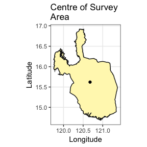

```{r check_packages, echo=FALSE, messages=FALSE, warning=FALSE}
required <- c("raster", "rgdal", "rgeos")

if (!all(unlist(lapply(required, function(pkg) requireNamespace(pkg, quietly = TRUE)))))
  knitr::opts_chunk$set(eval = FALSE)
```

# Gather Data for IRRI Central Luzon Survey Loop

The IRRI (International Rice Research Institute) survey loop in Central Luzon is a study that aims to monitor the changes in rice farming in the major rice producing area of the Philippines - the Central Luzon region, which is called as the "rice bowl of the Philippines". Data have been collected in this project since the 1960s. See, <http://ricestat.irri.org/fhsd/php/panel.php?page=1&sortBy=title&sortOrder=ascending#> for the panel data.

This vignette details how to find and retrieve weather data for the area that this survey covers for the time period of 1960-2016. Methods that are detailed include: 

  * retrieving a spatial object of provincial level data;  
  
  * sub-setting this data for the provinces of interest;  
  
  * merging the polygons into one object;  
  
  * finding the centroid of this resulting polygon;  
  
  * using the centroid of the polygon to find stations within 100km of this point;  
  
  * determining which stations provide data for the specified time-period, 1960-2015; and   
  
  * downloading the station files and creating a single CSV file of the data for analysis.  

### Retrieve PHL Provincial Data and Select Loop Provinces

As a first step, we'll use the [_raster_](https://cran.r-project.org/package=raster) package to retrieve data from [GADM](http://www.gadm.org/) that will provide the provincial spatial data for the survey area. We will then use this to find the centroid of the area of interest, which will be used to find the nearest stations. Using `raster::getData()` fetch level 0 (national) and 1 (provincial) data for the Philippines.

```r
library(raster)
RP0 <- raster::getData(country = "Philippines", level = 0)
RP1 <- raster::getData(country = "Philippines", level = 1)
```

Now we will select the provinces involved in the survey and make a new object called `Central_Luzon` from the provincial level data, `RP1`.

```r
Central_Luzon <- RP1[RP1@data$NAME_1 == "Pampanga" | 
                     RP1@data$NAME_1 == "Tarlac" |
                     RP1@data$NAME_1 == "Pangasinan" |
                     RP1@data$NAME_1 == "La Union" |
                     RP1@data$NAME_1 == "Nueva Ecija" |
                     RP1@data$NAME_1 == "Bulacan", ]
```

Next, create a map inset showing where the Central Luzon Loop survey takes place.

First we'll use `gSimplify()` from _rgeos_ to simplify the map of the Philippines to make the map generation in the next few steps quicker.

```r
RP0 <- rgeos::gSimplify(RP0, tol = 0.05)
```

```r
library(ggplot2)
library(grid)
library(gridExtra)

CL_names <- data.frame(coordinates(Central_Luzon)) # get center coordinates of provinces in Central Luzon
CL_names$label <- Central_Luzon@data$NAME_1

# Main Map
p1 <- ggplot() + 
  geom_polygon(data = Central_Luzon, aes(x = long, y = lat, group = group),
               colour = "grey10", fill = "#fff7bc") +
  geom_text(data = CL_names, aes(x = X1, y = X2, label = label), 
            size = 2, colour = "grey20") +
  theme(axis.text.y = element_text(angle = 90, hjust = 0.5)) +
  ggtitle("Central Luzon Provinces Surveyed") +
  theme_bw() + 
  xlab("Longitude") + 
  ylab("Latitude") +
  coord_map()

# Inset
p2 <- ggplot() + 
  geom_polygon(data = RP0, aes(long, lat, group = group),
               colour = "grey10",
               fill = "#fff7bc") +
  coord_equal() +
  theme_bw() + 
  labs(x = NULL, y = NULL) +
  geom_rect(aes(xmin = extent(Central_Luzon)[1],
                xmax = extent(Central_Luzon)[2],
                ymin = extent(Central_Luzon)[3],
                ymax = extent(Central_Luzon)[4]),
            alpha = 0,
            colour = "red",
            size = 0.7,
            linetype = 1) +
  theme(axis.text.x = element_blank(),
        axis.text.y = element_blank(),
        axis.ticks = element_blank(),
        axis.title.x = element_blank(),
        axis.title.y = element_blank(),
        plot.margin = unit(c(0, 0, 0 ,0), "mm"))

grid.newpage()
v1 <- viewport(width = 1, height = 1, x = 0.5, y = 0.5) # plot area for the main map
v2 <- viewport(width = 0.28, height = 0.28, x = 0.76, y = 0.76) # plot area for the inset map
print(p1, vp = v1) 
print(p2, vp = v2)
```


### Dissolve Polygons and Find Centroid of Loop Survey Area

Now that we have the provincial data that we want, we will dissolve the polygons that represent the individual provinces in Central Luzon and find the centroid of all of them, which we will use as the central point for querying stations from the GSOD data set.

```r
Central_Luzon <- rgeos::gUnaryUnion(Central_Luzon)
centroid <- rgeos::gCentroid(Central_Luzon)

ggplot() + 
  geom_polygon(data = Central_Luzon, aes(x = long, y = lat, group = group),
               colour = "grey10", fill = "#fff7bc") +
  geom_point(aes(x = centroid@coords[1], y = centroid@coords[2])) +
  theme(axis.text.y = element_text(angle = 90, hjust = 0.5)) +
  ggtitle("Centre of Survey\nArea") +
  theme_bw() + 
  xlab("Longitude") + 
  ylab("Latitude") +
  coord_map()
```



Next, make a list of stations that are within this area. First we need to fetch the station medadata, "isd-history.csv" from the FTP server and then check which stations fall within a 100km radius of the centre of the provinces we're interested in.

```r
library(GSODR)
library(readr)
# Fetch station list from NCEI
station_meta <- read_csv(
  "ftp://ftp.ncdc.noaa.gov/pub/data/noaa/isd-history.csv",
  col_types = "ccccccddddd",
  col_names = c("USAF", "WBAN", "STN_NAME", "CTRY", "STATE", "CALL", "LAT",
                "LON", "ELEV_M", "BEGIN", "END"), skip = 1)
station_meta$STNID <- as.character(paste(station_meta$USAF,
                                         station_meta$WBAN,
                                         sep = "-"))

loop_stations <- nearest_stations(LAT = centroid@coords[2],
                                  LON = centroid@coords[1], 
                                  distance = 100)

loop_stations <- station_meta[station_meta$STNID %in% loop_stations, ]

loop_stations <- loop_stations[loop_stations$BEGIN <= 19591231 &
                               loop_stations$END >= 20151231, ]

print(loop_stations[, c(1:2, 3, 7:12)])
```

```r
## # A tibble: 9 × 9
##     USAF  WBAN          STN_NAME    LAT     LON ELEV_M    BEGIN      END
##    <chr> <chr>             <chr>  <dbl>   <dbl>  <dbl>    <dbl>    <dbl>
## 1 983240 99999  IBA/LUZON ISLAND 15.333 119.967    5.0 19490104 20170324
## 2 983250 99999           DAGUPAN 16.083 120.350    2.0 19450119 20170324
## 3 983270 99999        CLARK INTL 15.186 120.560  147.5 19450214 20170324
## 4 983280 99999            BAGUIO 16.375 120.620 1295.7 19490101 20170324
## 5 984260 41231 SUBIC BAY WEATHER 14.800 120.267   19.0 19450209 20170324
## 6 984290 99999 NINOY AQUINO INTL 14.509 121.020   22.9 19450331 20170324
## 7 984300 99999    SCIENCE GARDEN 14.650 121.050   46.0 19450228 20170324
## 8 984320 99999          AMBULONG 14.083 121.050   11.0 19490205 20170324
## 9 984330 99999             TANAY 14.583 121.367  651.0 19490101 20170324
## # ... with 1 more variables: STNID <chr>
```

These are all of the stations that are availble within 100km of the centroid of this area and the years for which data are available.

### Using `get_GSOD()` to Fetch the Requested Station Files

This example shows how you could construct a query using the `get_GSOD()` function. Be aware that it may result in incomplete data and error from the server if it stops responding. We've done our best to make _GSODR_ handle these errors, but if it does this, see the following option for using the `reformat_GSOD()` function.

```r
PHL <- get_GSOD(station = 
                  eval(parse(text = loop_stations[, 12])), years = 1960:2015)
```

### Another Option, Using `reformat_GSOD()`

_GSODR_ provides a function for dealing with local files that have been transferred from the server already as well, `reformat_GSOD()`. If the previous example with `get_GSOD()` does not work, this is a good alternative that takes a bit more intervention but gives the same results.

Using your FTP client (*e.g.*, FileZilla) log into the NCEI FTP server, [<ftp.ncdc.noaa.gov>](ftp.ncdc.noaa.gov) and navigate to /pub/data/gsod/. Manually downloading the files for each station listed above from 1960 to 2015 is possible, but tedious. An easier solution is to simply download the annual files found in each yearly directory, "gsod-YYYY.tar" and untar them locally and then use R to list the available files and select only the files for the stations of interest. Lastly, write the data to disk as a CSV file for saving and later use.

```r
years <- 1960:2015

loop_stations <- eval(parse(text = loop_stations[, 12]))

# create file list
loop_stations <- do.call(
  paste0, c(expand.grid(loop_stations, "-", years, ".op.gz"))
  )

local_files <- list.files(path = "./GSOD", full.names = TRUE, recursive = TRUE)
local_files <- local_files[basename(local_files) %in% loop_stations]

loop_data <- reformat_GSOD(file_list = local_files)

readr::write_csv(loop_data, file = "Loop_Survey_Weather_1960-2015")
```

# Notes

## Sources

#### Elevation Values

90m hole-filled SRTM digital elevation (Jarvis *et al.* 2008) was used to identify and correct/remove elevation errors in data for station locations between -60˚ and 60˚ latitude. This applies to cases here where elevation was missing in the reported values as well. In case the station reported an elevation and the DEM does not, the station reported is taken. For stations beyond -60˚ and 60˚ latitude, the values are station reported values in every instance. See <https://github.com/ropensci/GSODR/blob/master/data-raw/fetch_isd-history.md>
for more detail on the correction methods.

## WMO Resolution 40. NOAA Policy

*Users of these data should take into account the following (from the [NCEI website](http://www7.ncdc.noaa.gov/CDO/cdoselect.cmd?datasetabbv=GSOD&countryabbv=&georegionabbv=)):*

> "The following data and products may have conditions placed on their international commercial use. They can be used within the U.S. or for non-commercial international activities without restriction. The non-U.S. data cannot be redistributed for commercial purposes. Re-distribution of these data by others must provide this same notification." [WMO Resolution 40. NOAA Policy](https://public.wmo.int/en/our-mandate/what-we-do/data-exchange-and-technology-transfer)

References
==========

Jarvis, A., Reuter, H.I., Nelson, A., Guevara, E. (2008) Hole-filled SRTM for the globe Version 4, available from the CGIAR-CSI SRTM 90m Database (<http://srtm.csi.cgiar.org>)

