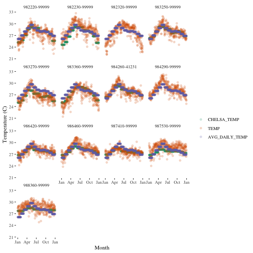

# Introduction

The GSOD data allow for users to use spatial methods with it. Using various
R packages such as _sf_, you can save data as a GeoPackage file which can be
read by most GIS software packages or in R using R's GIS capabilities with
other contributed packages as well.

Following is an example of how you might download and save GSOD annual data for
a given country, Philippines in this example, and convert it into a KML file for
viewing in GoogleEarth. The second portion uses the same GeoPackage file to
import the data back into R and combine the GSOD data with CHELSA data from the
[GSODRdata package](https://github.com/adamhsparks/GSODRdata) available from
GitHub and plot the station temperatures for daily GSOD, average monthly GSOD
and CHELSA temperatures (1979-2013).

## Example - Download and Plot Data for a Single Country

This example will demonstrate how to download data for Philippines for year 2010
and generate a spatial, year summary file, PHL-2010.gpkg, in the user's home
directory and link it with climate data from the _GSODRdata_ package.

Download data for Philippines for year 2010 and generate a spatial, year summary
file, PHL-2010.gpkg, in the user's home directory.


```r
library(GSODR)
library(sf)
PHL <-
  get_GSOD(years = 2010,
           country = "Philippines",
           max_missing = 5)

PHL <- st_as_sf(
  x = PHL,
  coords = c("LONGITUDE", "LATITUDE"),
  crs = "+proj=longlat +datum=WGS84"
)

write_sf(obj = PHL, dsn = file.path(tempdir(), "PHL-2010.gpkg"))
```

## Example - Use the GeoPackage File to Create a KML File

Using the GeoPackage that was just created, you can now create a KML file to
open with Google Earth and visualise the data spatially and over time.


```r
library(rgdal)
library(spacetime)
library(plotKML)

layers <- ogrListLayers(dsn = file.path(tempdir(), "PHL-2010.gpkg"))
pnts <-
  readOGR(dsn = file.path(tempdir(), "PHL-2010.gpkg"), layers[1])
```

```
## OGR data source with driver: GPKG 
## Source: "/private/var/folders/_x/gqh2xrvn4qb0qs5d8795n8vr0000gn/T/RtmpS2DFky/PHL-2010.gpkg", layer: "PHL-2010"
## with 4709 features
## It has 42 fields
```

```r
# Plot results in Google Earth as a spacetime object:
pnts$DATE = as.Date(paste(pnts$YEAR, pnts$MONTH, pnts$DAY, sep = "-"))
row.names(pnts) <- paste("point", 1:nrow(pnts), sep = "")

tmp_ST <- STIDF(
  sp = as(pnts, "SpatialPoints"),
  time = pnts$DATE - 0.5,
  data = pnts@data[, c("TEMP", "STNID")],
  endTime = pnts$DATE + 0.5
)

shape = "http://maps.google.com/mapfiles/kml/pal2/icon18.png"

kml(
  tmp_ST,
  dtime = 24 * 3600,
  colour = TEMP,
  shape = shape,
  labels = TEMP,
  file.name = "Temperatures_PHL_2010-2010.kml",
  folder.name = "TEMP"
)

system("zip -m Temperatures_PHL_2010-2010.kmz Temperatures_PHL_2010-2010.kml")
```

## Example - Compare the GSOD Weather Data From the Philippines With Climate
Data Provided by the _GSODRdata_ Package.

The [`GSODRdata`](https://adamhsparks.github.io/GSODRdata/) package provides
climate data from four climate data sets that have been formatted for easy use
with the _GSODR_ package. Following is a description how to install the
_GSODRdata_ package and use it to visualise the weather data for the Philippines
in 2010 against CHELSA data.

CHELSA (Climatologies at High resolution for the Earth’s Land Surface Areas) are
climate data at 30 arc seconds for the Earth's land surface areas.

**Description of CHELSA data from CHELSA website**

> CHELSA is a high resolution (30 arc sec) climate data set for the earth land surface areas currently under development in coorporation [_sic_] with the Department of Geography of the University of Hamburg (Prof. Dr. Jürgen Böhner, Dr. Olaf Conrad, Tobias Kawohl), the Swiss Federal Institute for Forest, Snow and Landscape Research WSL (Prof. Dr. Niklaus Zimmermann), the University of Zurich (Dr. Dirk N. Karger, Dr. Michael Kessler), and the University of Göttingen (Prof. Dr. Holger Kreft).
It includes monthly mean temperature and precipitation patterns for the time period 1979-2013.
CHELSA is based on a quasi-mechanistical statistical downscaling of the ERA interim global circulation model (http://www.ecmwf.int/en/research/climate-reanalysis/era-interim) with a GPCC bias correction (https://www.dwd.de/EN/ourservices/gpcc/gpcc.html) and is freely available  in the download section.

See http://chelsa-climate.org for more information on these data.


```r
if (!require(devtools)) {
  install.packages("devtools",
                   repos = c(CRAN = "https://cloud.r-project.org/"))
  library(devtools)
}
devtools::install_github("adamhsparks/GSODRdata")
```

Now that the extra data have been installed, take a look at the CHELSA data that
are one of the data sets included in the _GSODRdata_ package.


```r
library(GSODRdata)
library(skimr)

skim(CHELSA)
```

```
## Skim summary statistics
##  n obs: 23927 
##  n variables: 46 
## 
## ── Variable type:character ─────────────────────────────────────────────────────────────
##  variable missing complete     n min max empty n_unique
##     STNID       0    23927 23927  12  12     0    23821
## 
## ── Variable type:numeric ───────────────────────────────────────────────────────────────
##                     variable missing complete     n   mean     sd    p0
##   CHELSA_bio1_1979-2013_V1_1       0    23927 23927  13.55   8.22 -21.1
##  CHELSA_bio10_1979-2013_V1_1       0    23927 23927  22.59   5.57  -9.1
##  CHELSA_bio11_1979-2013_V1_1       0    23927 23927   4.19  12.2  -44.1
##  CHELSA_bio12_1979-2013_V1_1       0    23927 23927 910.16 612.07   0.2
##  CHELSA_bio13_1979-2013_V1_1       0    23927 23927 135.34 104.42   0.1
##  CHELSA_bio14_1979-2013_V1_1       0    23927 23927  34.36  32.27   0  
##  CHELSA_bio15_1979-2013_V1_1       0    23927 23927  48.27  31.17   6.8
##  CHELSA_bio16_1979-2013_V1_1       0    23927 23927 387.24 295.97   0.1
##  CHELSA_bio17_1979-2013_V1_1       0    23927 23927 109.86 101.59   0  
##  CHELSA_bio18_1979-2013_V1_1       0    23927 23927 254.12 202.56   0  
##  CHELSA_bio19_1979-2013_V1_1       0    23927 23927 183.24 198.41   0  
##   CHELSA_bio2_1979-2013_V1_1       0    23927 23927  19.31   5.87   3  
##   CHELSA_bio3_1979-2013_V1_1       0    23927 23927  52.44  10.01  29.3
##   CHELSA_bio4_1979-2013_V1_1       0    23927 23927 673.06 348.8    7.6
##   CHELSA_bio5_1979-2013_V1_1       0    23927 23927  32.03   5.58  -1.5
##   CHELSA_bio6_1979-2013_V1_1       0    23927 23927  -6.74  15.41 -55.5
##   CHELSA_bio7_1979-2013_V1_1       0    23927 23927  38.77  14.59   4  
##   CHELSA_bio8_1979-2013_V1_1       0    23927 23927  17.65   7.66 -29.6
##   CHELSA_bio9_1979-2013_V1_1       0    23927 23927   9.9   13.74 -36.3
##      CHELSA_prec_1_1979-2013       0    23927 23927  68.28  69.25   0  
##     CHELSA_prec_10_1979-2013       0    23927 23927  77.46  65.43   0  
##     CHELSA_prec_11_1979-2013       0    23927 23927  72.5   63.95   0  
##     CHELSA_prec_12_1979-2013       0    23927 23927  70.82  66.84   0  
##   CHELSA_prec_1979-2013_land       0    23927 23927 910    612.88   0.2
##      CHELSA_prec_2_1979-2013       0    23927 23927  61.29  60.98   0  
##      CHELSA_prec_3_1979-2013       0    23927 23927  67.59  60.06   0  
##      CHELSA_prec_4_1979-2013       0    23927 23927  66.02  53.5    0  
##      CHELSA_prec_5_1979-2013       0    23927 23927  76.52  61.01   0  
##      CHELSA_prec_6_1979-2013       0    23927 23927  87.07  78.4    0  
##      CHELSA_prec_7_1979-2013       0    23927 23927  92.22  90.25   0  
##      CHELSA_prec_8_1979-2013       0    23927 23927  89.22  83.84   0  
##      CHELSA_prec_9_1979-2013       0    23927 23927  83.46  72.62   0  
##      CHELSA_temp_1_1979-2013       0    23927 23927   5.09  13.63 -44.7
##     CHELSA_temp_10_1979-2013       0    23927 23927  14.42   8.14 -23.6
##     CHELSA_temp_11_1979-2013       0    23927 23927   9.88  10.65 -30.8
##     CHELSA_temp_12_1979-2013       0    23927 23927   6.26  12.72 -43  
##   CHELSA_temp_1979-2013_land       0    23927 23927  13.55   8.22 -21.1
##      CHELSA_temp_2_1979-2013       0    23927 23927   6.29  13.02 -39.1
##      CHELSA_temp_3_1979-2013       0    23927 23927   9.53  11.01 -28.5
##      CHELSA_temp_4_1979-2013       0    23927 23927  13.42   8.61 -23  
##      CHELSA_temp_5_1979-2013       0    23927 23927  17.01   6.95 -16  
##      CHELSA_temp_6_1979-2013       0    23927 23927  19.8    6.37 -10.6
##      CHELSA_temp_7_1979-2013       0    23927 23927  19.8    6.37 -10.6
##      CHELSA_temp_8_1979-2013       0    23927 23927  21.09   6.07 -11.1
##      CHELSA_temp_9_1979-2013       0    23927 23927  18.39   6.56 -17.4
##     p25   p50     p75   p100     hist
##    7.8   12.8   19.7    31.2 ▁▁▁▃▇▆▅▃
##   18.2   22.8   26.8    39.3 ▁▁▁▂▇▇▅▁
##   -3.6    3.7   12.6    28.5 ▁▁▁▃▇▇▅▅
##  492.05 782.8 1196.2  9701.5 ▇▂▁▁▁▁▁▁
##   74.3  104.7  161    2083.5 ▇▁▁▁▁▁▁▁
##    9.3   27.6   51.7   384.9 ▇▃▁▁▁▁▁▁
##   23.3   39.9   66.3   206   ▇▆▃▂▁▁▁▁
##  214.1  302    462.95 5869.1 ▇▁▁▁▁▁▁▁
##   31.5   88.3  164.1  1195.6 ▇▃▁▁▁▁▁▁
##  128.4  223.7  325.2  5021.5 ▇▁▁▁▁▁▁▁
##   61.65 131.9  232.6  5034.3 ▇▁▁▁▁▁▁▁
##   15.2   20.1   23.7    30.6 ▁▂▃▅▆▇▆▂
##   45.4   50.1   57      93.3 ▁▅▇▃▂▁▁▁
##  414.9  698.3  892.6  2319.2 ▃▅▇▅▂▁▁▁
##   29.3   32.3   35.3    49.8 ▁▁▁▁▅▇▂▁
##  -17.3   -6.8    3.75   25.5 ▁▁▃▆▇▇▅▃
##   28.8   39.7   48.2    87.7 ▂▃▅▇▅▃▁▁
##   12     18.2   24.4    35.7 ▁▁▁▁▅▇▇▂
##   -1.4   11.4   21.7    39.3 ▁▁▂▇▅▇▇▁
##   22     49.7   87     680   ▇▂▁▁▁▁▁▁
##   34.2   65.3   97     647   ▇▃▁▁▁▁▁▁
##   29.3   59.7   93     596.4 ▇▃▁▁▁▁▁▁
##   23.8   54     93.5   681.5 ▇▂▁▁▁▁▁▁
##  491.8  781.7 1195    9773.6 ▇▂▁▁▁▁▁▁
##   21.3   43.9   78.7   535.8 ▇▃▁▁▁▁▁▁
##   27.8   51.3   90.9   605.3 ▇▃▁▁▁▁▁▁
##   30.3   53.4   86.6   524   ▇▅▁▁▁▁▁▁
##   36.8   63.8   99.1   832.5 ▇▂▁▁▁▁▁▁
##   41.3   74.3  107.5  1201.9 ▇▁▁▁▁▁▁▁
##   41     76    112.7  1278.6 ▇▁▁▁▁▁▁▁
##   38.8   73.7  108.7   964.8 ▇▂▁▁▁▁▁▁
##   37.6   67.6  102.3   710.5 ▇▃▁▁▁▁▁▁
##   -4      3.6   16.4    33.5 ▁▁▂▃▇▅▃▃
##    8.7   13.5   20.8    32.9 ▁▁▁▂▇▆▅▃
##    2.8    8.5   18.6    33.2 ▁▁▁▃▇▅▅▂
##   -2      4.7   16.6    33   ▁▁▁▃▇▆▅▃
##    7.8   12.8   19.7    31.3 ▁▁▁▃▇▆▅▃
##   -2.8    4.6   17.6    32.4 ▁▁▂▅▇▅▃▃
##    1.5    7.8   18.8    32.3 ▁▁▂▅▇▅▅▃
##    7.1   12.3   19.6    34.7 ▁▁▁▅▇▆▅▂
##   12     16.1   22.1    36.5 ▁▁▁▂▇▅▃▁
##   15.2   19.6   24.7    38.5 ▁▁▁▃▇▇▃▁
##   15.2   19.6   24.7    38.5 ▁▁▁▃▇▇▃▁
##   16.8   21.3   25.9    39.1 ▁▁▁▂▇▇▅▁
##   13.5   17.9   23.8    35.6 ▁▁▁▂▇▇▇▁
```

Compare the GSOD weather data from the Philippines with climatic data provided
by the _GSODRdata_ package in the CHELSA data set using `dplyr` functions to
join the CHELSA and _GSODR_ data for plotting.


```r
library(dplyr)
library(ggplot2)
library(reshape2)

cnames <- paste0("CHELSA_temp_", 1:12, "_1979-2013")
clim_temp <- CHELSA[CHELSA$STNID %in% pnts$STNID,
                    paste(c("STNID", cnames))]
clim_temp_df <- data.frame(
  STNID = rep(clim_temp$STNID, 12),
  MONTHC = as.vector(sapply(1:12, rep,
                            times = nrow(clim_temp))),
  CHELSA_TEMP = as.vector(unlist(clim_temp[, cnames]))
)

pnts$MONTHC <- as.numeric(paste(pnts$MONTH))
temp <-
  left_join(pnts@data, clim_temp_df, by = c("STNID", "MONTHC"))
```

```
## Warning: Column `STNID` joining factors with different levels, coercing to
## character vector
```

```r
temp <- temp %>%
  group_by(MONTH) %>%
  mutate(AVG_DAILY_TEMP = round(mean(TEMP), 1))

df_melt <-
  na.omit(melt(temp[, c("STNID", "DATE", "CHELSA_TEMP", "TEMP", "AVG_DAILY_TEMP")],
               id = c("DATE", "STNID")))

ggplot(df_melt, aes(x = DATE, y = value)) +
  geom_point(aes(color = variable), alpha = 0.2) +
  scale_x_date(date_labels = "%b") +
  ylab("Temperature (C)") +
  xlab("Month") +
  labs(colour = "") +
  scale_color_brewer(palette = "Dark2") +
  facet_wrap( ~ STNID) +
  theme_classic()
```



# Notes

## Sources

#### CHELSA Climate Layers
CHELSA (climatic surfaces at 1 km resolution) is based on a quasi-mechanistical
statistical downscaling of the ERA interim global circulation model (Karger et
al. 2016). ESA's CCI-LC cloud probability monthly averages are based
on the MODIS snow products (MOD10A2). <http://chelsa-climate.org/>

## WMO Resolution 40. NOAA Policy

*Users of these data should take into account the following (from the [NCEI website](http://www7.ncdc.noaa.gov/CDO/cdoselect.cmd?datasetabbv=GSOD&countryabbv=&georegionabbv=)):*

> "The following data and products may have conditions placed on their international commercial use. They can be used within the U.S. or for non-commercial international activities without restriction. The non-U.S. data cannot be redistributed for commercial purposes. Re-distribution of these data by others must provide this same notification." [WMO Resolution 40. NOAA Policy](https://public.wmo.int/en/our-mandate/what-we-do/data-exchange-and-technology-transfer)

# References

Karger, D. N., Conrad, O., Bohner, J., Kawohl, T., Kreft, H., Soria-Auza, R. W.,
*et al*. (2016) Climatologies at high resolution for the Earth land surface
areas. *arXiv preprint* **arXiv:1607.00217**. (<http://chelsa-climate.org/>)

Stachelek, J. (2016) Using the Geopackage Format with R.
URL: https://jsta.github.io/2016/07/14/geopackage-r.html
